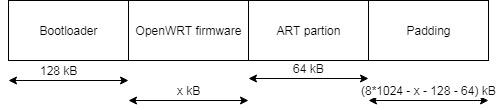
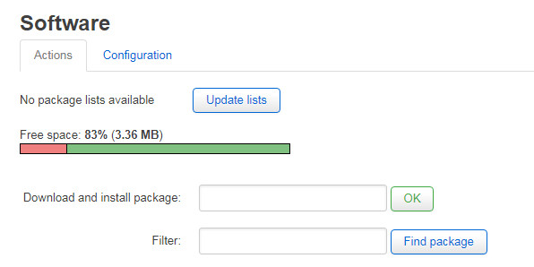

+++
title = "Upgrading TPLink TL-WR840N v5 flash chip"
description = "TPLink TL-WR840N v5 came with only 4Mb of flash, it was not enough for me. I want more functionality on this device, so I decided to upgrade its flash to 8Mb."
date = 2019-02-11T09:19:42+01:00

[taxonomies]
categories = ["Router"]
tags = ["TL-WR840N"]

[extra]
toc = true
math = true
math_auto_render = true
+++


I will show you how to upgrade TP-Link flash chip on TP-Link from 4mb to 8mb.

## 1. Pre-requirement

- New flash chip: I used Winbond 8MiB GD25Q64CSIG
- Soldering iron: desolder old flash chip and re-solder new flash chip
- ROM programer and IC socket: I am using CH-341A (~ 5$)
- One PC/Laptop

## 2. Let's do it

### 2.1 Desolder old flash chip

Hot air soldering station is ideally suited for desoldering flash. If you not, you can follow this video to do this.

{{yt(id="nZGEtpECPQY")}}

### 2.2 Program new flash chip

Firstly, you need to choose new flash chip you want to replace. Why I chose `Winbond GD25Q64CSIG` for replacement, see table bellow:

| Description |          Original         |                               Mod                               |
|-------------|---------------------------|-----------------------------------------------------------------|
| flash       | GigaDevice GD25Q32B (4MB) | Winbond GD25Q64CSIG (8MB)                                       |
| firmware    | TL-WR840N(VN)_V5_170517   | openwrt-18.06.1-ramips-mt76x8-tl-wr841n-v13-squashfs-sysupgrade |

I see the name of flash chip is the same, so I didn't checked datasheet for compatible.

Secondly, you need to choose OpenWRT firmware.
Why I used openwrt-18.06.1-ramips-mt76x8-tl-**wr841n-v13**-squashfs-sysupgrade instead of openwrt-18.06.1-ramips-mt76x8-tl-**wr840n-v5**-squashfs-sysupgrade?

Because it used the same CPU and different in flash and RAM chip.

| Description | [TP-LINK TL-WR841N v13.x](https://wikidevi.com/wiki/TP-LINK_TL-WR841N_v13.x) | [TP-LINK TL-WR840N v5](https://wikidevi.com/wiki/TP-LINK_TL-WR840N_v5) |
|-------------|------------------------------------------------------------------------------|------------------------------------------------------------------------|
| CPU         | MediaTek MT7628NN (580MHz)                                                   | MediaTek MT7628NN @575MHz                                              |
| RAM         | Winbond W9751G6JB-25 (64MB)                                                  | ESMT M14D5121632A (64MB)                                               |
| Flash       | GigaDevice GD25Q64CSIG (8MB)                                                 | GigaDevice GD25Q32B (4MB)                                              |

👉 You are able to use openwrt-18.06.1-ramips-mt76x8-tl-**wr840n-v5**-squashfs-sysupgrade with 8MB flash chip, your router still booting but you can not any configuration after reboot. You may got error `Your image is probably too big, leaving not enough space for jffs2`.

In the first time, I faced this problem. I can not save any configuration after reboot. If you look at boot log, it read:

```bash
fixed-partitions partitions found on MTD device spi0.0
Creating 3 MTD partitions on "spi0.0":
0x000000000000-0x000000020000 : "boot"
0x000000020000-0x0000003f0000 : "firmware"
2 tplink-fw partitions found on MTD device firmware
0x000000020000-0x00000017d048 : "kernel"
0x00000017d048-0x0000003f0000 : "rootfs"
mtd: device 3 (rootfs) set to be root filesystem
1 squashfs-split partitions found on MTD device rootfs
0x0000003b0000-0x0000003f0000 : "rootfs_data"
0x0000003f0000-0x000000400000 : "factory"

m25p80 spi0.0: s25fl064k (8192 Kbytes)

VFS: Mounted root (squashfs filesystem) readonly on device 31:3.
Freeing unused kernel memory: 208K
This architecture does not have kernel memory protection.
init: Console is alive
init: - watchdog -
random: fast init done
kmodloader: loading kernel modules from /etc/modules-boot.d/*
kmodloader: done loading kernel modules from /etc/modules-boot.d/*
init: - preinit -
rt3050-esw 10110000.esw: link changed 0x00
random: procd: uninitialized urandom read (4 bytes read)
jffs2: Too few erase blocks (4)  --> Your image is probably too big, leaving not enough space for jffs2.
mount_root: failed to mount -t jffs2 /dev/mtdblock4 /tmp/overlay: Invalid argument
mount_root: overlay filesystem has not been fully initialized yet
mount_root: switching to jffs2 overlay
mount_root: switching to jffs2 failed - fallback to ramoverlay
urandom-seed: Seed file not found (/etc/urandom.seed)
```

No `/overlay` will be mounted:

```bash
root@OpenWrt:~# df -h
Filesystem                Size      Used Available Use% Mounted on
/dev/root                 2.3M      2.3M         0 100% /rom
tmpfs                    29.5M    532.0K     29.0M   2% /tmp
tmpfs                    29.5M     56.0K     29.5M   0% /tmp/root
overlayfs:/tmp/root      29.5M     56.0K     29.5M   0% /
tmpfs 
```

If everything is good, it should be like this:

```bash
root@OpenWrt:~# df -h
Filesystem                Size      Used Available Use% Mounted on
/dev/root                 2.3M      2.3M         0 100% /rom
tmpfs                    29.5M    540.0K     29.0M   2% /tmp
/dev/mtdblock4            4.1M    304.0K      3.8M   7% /overlay
overlayfs:/overlay        4.1M    304.0K      3.8M   7% /
tmpfs                   512.0K         0    512.0K   0% /dev
root@OpenWrt:~# 
root@OpenWrt:~# cat /proc/mtd
dev:    size   erasesize  name
mtd0: 00020000 00010000 "boot"
mtd1: 007a0000 00010000 "firmware"
mtd2: 0015d05b 00010000 "kernel"
mtd3: 00642fa4 00010000 "rootfs"
mtd4: 00410000 00010000 "rootfs_data"
mtd5: 00010000 00010000 "config"
mtd6: 00030000 00010000 "factory"
```

Now, you have new flash chip and suitable firware, but you can not use this firware to program new flash chip. Because **RAW** flash need more partion than firmware such as: bootloader and art. See more in [here](https://openwrt.org/docs/techref/flash.layout)

You can use bellow shell script to generate firmware for any flash with different capacity.

```bash
set -e
flash_size_in_MB=8
sysupgrade_OpenWRT="openwrt-18.06.1-ramips-mt76x8-tl-wr840n-v5-squashfs-sysupgrade.bin"
art_file="upload_openwrt_art.bin"
boot_loader="upload_openwrt_mtd0.bin"

sysupgrade_OpenWRT_size=$(wc -c $sysupgrade_OpenWRT | cut -f 1 -d " ")
art_file_size=$(wc -c $art_file | cut -f 1 -d " ")
boot_loader_size=$(wc -c $boot_loader | cut -f 1 -d " ")


echo "sysupgrade_OpenWRT_size: " $sysupgrade_OpenWRT_size
echo "art_file_size: " $art_file_size
echo "boot_loader_size: " $boot_loader_size

padcount=$(($flash_size_in_MB * 1024 * 1024 - $boot_loader_size - $art_file_size - $sysupgrade_OpenWRT_size))

echo " Write boot loader"
dd if=$boot_loader bs=512 >> "${sysupgrade_OpenWRT}_dump".bin
echo "Write firmware"
dd if=$sysupgrade_OpenWRT bs=512 >> "${sysupgrade_OpenWRT}_dump".bin
echo "Write padding FF"
dd if=/dev/zero ibs=1 count="$padcount" | tr "\000" "\377" >> "${sysupgrade_OpenWRT}_dump".bin
echo "Write art partition"
dd if=$art_file bs=512 >> "${sysupgrade_OpenWRT}_dump".bin
```

|     parameter      |                                          Description                                          |
|--------------------|-----------------------------------------------------------------------------------------------|
| flash_size_in_MB   | new flash chip capacity                                                                       |
| sysupgrade_OpenWRT | OpenWRT image (firmware)                                                                              |
| art_file           | ART partion from original flash, the last 64k block of the chip no matter what the chip size. |
| boot_loader        | bootloader, the first 128kB from original flash                                               |
| Output firmware    | sysupgrade_OpenWRT_dump.bin, you can use this to program your new flash chip                  |

If you don't want to use this script, you can create image by yourself. You may to need hex editor like [HxDen](https://mh-nexus.de/en/hxd/) to do this.



All file which I used in [here](https://drive.google.com/file/d/1kqXvFQYrolipvrrD3Rkv7J7JTZwgVHDn/view?usp=sharing)

### 2.3 Re-solder new flash chip

After use CH341A to program new flash chip, you can re-solder new flash chip on target board.

👉 If your board can not booting, don't worry. You can use [Clip Socket Adapter](https://www.ebay.com/itm/SOIC8-SOP8-Flash-Chip-IC-Test-Clip-Socket-Adapter-BIOS-CH341A-USB-Programmer-/372555847443) to try program flash again with out desolder chip.

## 3. Enjoy



👉 I used image come from **TL-WR841N v13.x**, except for LED will not working, everything work well (Wi-Fi, Ethernet, Router feature).
