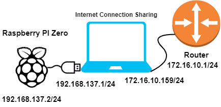
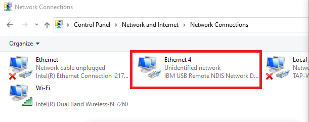
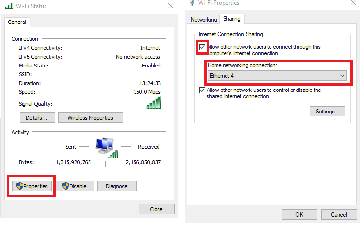
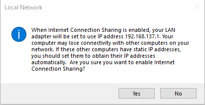

+++
title = "Connecting Raspberry Pi Zero (not W) to the Internet"
description = "How to connect Pi Zero to the Internet without using any extra components."
date = 2020-12-11T09:19:42+01:00

[taxonomies]
categories = ["Raspberry-Pi"]
tags = ["Pi-Zero"]

[extra]
toc = true
math = true
math_auto_render = true
+++

Raspi Zero (not W) have neither Wi-Fi nor Ethernet, so how could we want to update your raspbian without remove the microSD card?

Well, you can create a virtual Ethernet interface. This method is tested on **Window 10**, you could get the same idea when using Linux/Mac computer.

I am testing [2022-01-28-raspios-bullseye-armhf-lite image](https://downloads.raspberrypi.org/raspios_lite_armhf/images/raspios_lite_armhf-2022-01-28/2022-01-28-raspios-bullseye-armhf-lite.zip) version.

```bash
pi@raspberrypi:~ $ uname -a
Linux raspberrypi 5.10.92+ #1514 Mon Jan 17 17:35:21 GMT 2022 armv6l GNU/Linux
pi@raspberrypi:~ $ cat /proc/device-tree/model
Raspberry Pi Zero Rev 1.3
```

The network topology I'm going to deploy it as follows.



### 1. Update cmdline.txt and config.txt settings

This method is using `libcomposite`, so you need to include `libcomposite` in the `modules-load` directive as the following. For other methods, please visit [gbaman](https://gist.github.com/gbaman)/[HowToOTG.md](https://gist.github.com/gbaman/50b6cca61dd1c3f88f41).

```bash
root@raspberrypi:/home/pi# cat /boot/cmdline.txt
console=serial0,115200 console=tty1 root=PARTUUID=22e47bc0-02 rootfstype=ext4 fsck.repair=yes rootwait modules-load=dwc2,libcomposite
```

Add `dtoverlay=dwc2` at the end of `/boot/config.txt`

```bash
root@raspberrypi:/home/pi# cat /boot/config.txt
#
# Omitted
#
[cm4]
# Enable host mode on the 2711 built-in XHCI USB controller.
# This line should be removed if the legacy DWC2 controller is required
# (e.g. for USB device mode) or if USB support is not required.
otg_mode=1

[all]

[pi4]
# Run as fast as firmware / board allows
arm_boost=1

[all]
# Enable UART
enable_uart=1
dtoverlay=dwc2
```

### 2. Script to create a virtual UDC ethernet interface

The script below will create a virtual UDC ethernet interface.



```bash
#!/bin/sh
#
# Thanks to
#   wismna: http://github.com/wismna/raspberry-pi/hackpi
#   RoganDawes: https://github.com/RoganDawes/P4wnP1

# https://docs.microsoft.com/en-us/windows-hardware/drivers/usbcon/enumeration-of-the-composite-parent-device
# https://docs.microsoft.com/en-us/windows-hardware/drivers/usbcon/usb-common-class-generic-parent-driver

OS_CONFIG="window"
IP_SELF="192.168.137.2"
IP_HOST="192.168.137.1"

MAC_HOST="48:6f:73:74:50:43" # "Mac address for host PC"
MAC_SELF="42:61:64:55:53:42" # "MAC address for PiZero"
CONFIG=/sys/kernel/config/usb_gadget/PiZero

mkdir -p "$CONFIG"
cd "$CONFIG" || exit 1


# 0x04b3 = 1203
# {
#     "name": "IBM Corporation",
#     "field_vid": "1203"
# },
case $OS_CONFIG in
  window)
    # wismna hack for Window
    # IBM Corporation RNDIS Driver will be loaded
    echo 0x04b3 > idVendor
    echo 0x4010 > idProduct
    ;;
  *)
    echo 0x1d6b > idVendor   # Linux Foundation
    echo 0x0104 > idProduct  # Multifunction Composite Gadget
    ;;

esac

echo 0x0100 > bcdDevice
echo 0x0200 > bcdUSB

# Mandatory for Multiple Gadgets
echo 0xEF > bDeviceClass
echo 0x02 > bDeviceSubClass
echo 0x01 > bDeviceProtocol
echo 0x40 > bMaxPacketSize0

mkdir -p strings/0x409
mkdir -p configs/c.1/strings/0x409
echo 100000000d2386db         > strings/0x409/serialnumber
echo "PiZero Project" > strings/0x409/manufacturer
echo "PiZero "              > strings/0x409/product
echo 250                      > configs/c.1/MaxPower
echo "PiZero"               > configs/c.1/strings/0x409/configuration

config_acm(){
  mkdir -p functions/acm.usb0
  ln -s functions/acm.usb0 configs/c.1/acm.usb0
}

# Ethernet Adapter
#-------------------------------------------
config_rndis () {
  mkdir -p functions/rndis.usb0
  echo $MAC_HOST > functions/rndis.usb0/host_addr
  echo $MAC_SELF > functions/rndis.usb0/dev_addr

  mkdir -p os_desc
  echo "0x80"     > configs/c.1/bmAttributes
  echo "1"        > os_desc/use
  echo "0xbc"     > os_desc/b_vendor_code
  echo "MSFT100"  > os_desc/qw_sign

  mkdir -p functions/rndis.usb0/os_desc/interface.rndis
  echo "RNDIS"    > functions/rndis.usb0/os_desc/interface.rndis/compatible_id
  echo "5162001"  > functions/rndis.usb0/os_desc/interface.rndis/sub_compatible_id

  ln -s functions/rndis.usb0 configs/c.1/
  ln -s configs/c.1/ os_desc
}

config_ecm () {
  mkdir -p functions/ecm.usb0
  echo $MAC_HOST > functions/ecm.usb0/host_addr
  echo $MAC_SELF > functions/ecm.usb0/dev_addr
  ln -s functions/ecm.usb0 configs/c.1/
}

case $OS_CONFIG in
  window)
    config_rndis
    ;;
  macos | linux)
    config_ecm
    ;;
  *)
    config_acm
    ;;
esac

udevadm settle -t 5 || :
ls /sys/class/udc > UDC
ifconfig usb0 $IP_SELF netmask 255.255.255.252 up
route add -net default gw $IP_HOST

```



Save the file as `runme.sh`, and don't forget to change its permission to executable file.

```bash
root@raspberrypi:/home/pi# chmod +x runme.sh
```

In order to get the script run at boot up, one simple way is adding this script into `rc.local`. See more ways to do this at [How to Run a Raspberry Pi Program on Startup](https://learn.sparkfun.com/tutorials/how-to-run-a-raspberry-pi-program-on-startup/all).

```bash
root@raspberrypi:/home/pi# cat /etc/rc.local
#!/bin/sh -e
#
# Omitted
#
# Print the IP address
_IP=$(hostname -I) || true
if [ "$_IP" ]; then
  printf "My IP address is %s\n" "$_IP"
fi

/home/pi/runme.sh &

exit 0
```

If you want to ssh to your PiZero, you could enable SSHD for later use.

```bash
sudo systemctl enable ssh
sudo systemctl start ssh
```

It is time to reboot your PI to apply these settings.

### 3. Window settings for Internet Connection Sharing

Go to `Control Panel\Network and Internet\Network Connections`. If everything is good, you should see a new Ethernet Adapter (i.e., Ethernet 4 in my case).



Now, you need to share the Internet from your main NIC to the new created NIC by PiZero.



1. Right click on NIC icon choose `Properties`, go to `Properties` one more and then `Sharing` tab.
2. Check the `Allow Other Network Users ...` check box.
3. Under `Home networking connection`, choose the new NIC (i.e., `Ethernet 4` in my case)
4. Click `OK`

You will see a pop-up states that **Ethernet 4** IP address will be changed to `19.268.137.1`. That is why I used this IP address in the above `runme.sh` script.



Try to connect from your PC to your Pi Zero. I am using SSH to connect because I already enabled SSHD service on PiZero.

```bash
C:\Windows\system32>ssh pi@192.168.137.2
The authenticity of host '192.168.137.2 (192.168.137.2)' can't be established.
ECDSA key fingerprint is SHA256:LxSEz/DS/6u6EQQWI+rr.
Are you sure you want to continue connecting (yes/no/[fingerprint])? yes
Warning: Permanently added '192.168.137.2' (ECDSA) to the list of known hosts.
pi@192.168.137.2's password:
Linux raspberrypi 5.10.92+ #1514 Mon Jan 17 17:35:21 GMT 2022 armv6l

pi@raspberrypi:~ $
pi@raspberrypi:~ $ ping google.com
PING google.com (216.58.207.206) 56(84) bytes of data.
64 bytes from arn11s04-in-f14.1e100.net (216.58.207.206): icmp_seq=1 ttl=58 time=16.7 ms
64 bytes from arn11s04-in-f14.1e100.net (216.58.207.206): icmp_seq=2 ttl=58 time=16.4 ms
^C
--- google.com ping statistics ---
2 packets transmitted, 2 received, 0% packet loss, time 1002ms
rtt min/avg/max/mdev = 16.397/16.525/16.654/0.128 ms
```

In case you have problem with the DNS, try to change the DNS server on PiZero by editing `/etc/resolv.conf` file.

```bash
pi@raspberrypi:~ $ cat /etc/resolv.conf
# Generated by resolvconf
nameserver 8.8.8.8 
```



Done! Now you could use the Internet on your Pi Zero.

### 4. References

- [showmewebcam #76](https://github.com/showmewebcam/showmewebcam/pull/76/files)
- [How to Run a Raspberry Pi Program on Startup](https://learn.sparkfun.com/tutorials/how-to-run-a-raspberry-pi-program-on-startup/all)
- [gbaman](https://gist.github.com/gbaman)/[HowToOTG.md](https://gist.github.com/gbaman/50b6cca61dd1c3f88f41)
