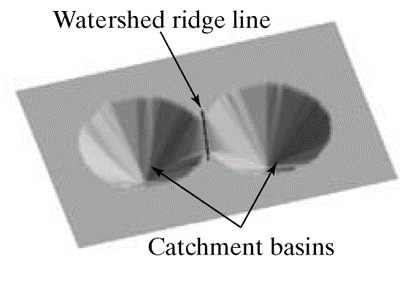

+++
title = "OpenCV C++ getting started"
description = "Getting started with OpenCV"
date = 2021-03-25

[taxonomies]
categories = ["Open-CV"]
tags = ["opencv"]

[extra]
toc = true
math = true
math_auto_render = true
+++

## Install

### Download

- Microsoft Visual C++ 2019 [Community](https://download.visualstudio.microsoft.com/download/pr/3a7354bc-d2e4-430f-92d0-9abd031b5ee5/d9fc228ea71a98adc7bc5f5d8e8800684c647e955601ed721fcb29f74ace7536/vs_Community.exe)
- [opencv_4.5.1](https://nchc.dl.sourceforge.net/project/opencvlibrary/4.5.1/opencv-4.5.1-vc14_vc15.exe)
- [opencv_3.4.13](https://nchc.dl.sourceforge.net/project/opencvlibrary/3.4.13/opencv-3.4.13-vc14_vc15.exe)

### Configure

https://acodary.wordpress.com/2018/07/24/opencv-cai-dat-opencv-visual-c-tren-windows/

- Project > Property
  - Platform: x64
  - Configuration Properties
    - C/C++ > General: opencv\build\include
    - Linker > General: opencv\build\x64\vc15\lib
    - Linker > Input:
      - For openCV_4.5.1: `opencv_world451d.lib` OR `opencv_world451.lib` (d for debug)
      - For opencv_3.4.13: `opencv_world3413d.lib`
- Add `D:\tuyenld\dev\opencv_3.4.13\build\x64\vc15\bin` (remember to correct your path) to PATH environment

#### Histogram equalization (HE)

- This is just a method, which may not give a flat full spectrum result.
- If the histogram of a problem is continuously changing, then the HE (automatic) method should be used. In other cases, a fixed histogram can be used and HE is not necessary.

### Learning OpenCV 3 Computer Vision in C++ with the OpenCV Library (Adrian Kaehler and Gary Bradski)

https://github.com/oreillymedia/Learning-OpenCV-3_examples

### Code

- [Online](https://docs.opencv.org/3.4.13)

### distanceTransform

[Ref1](https://www.tutorialspoint.com/opencv/opencv_distance_transformation.htm)

- takes **binary images** as inputs.
- the **gray level intensities** of the points inside the foreground regions are changed to distance their respective distances from the closest 0 value (boundary)

### Type

- [Ref1](http://ninghang.blogspot.com/2012/11/list-of-mat-type-in-opencv.html)
- [Ref2](https://stackoverflow.com/questions/8377091/what-are-the-differences-between-cv-8u-and-cv-32f-and-what-should-i-worry-about/8377146)

A Mapping of Type to Numbers in OpenCV

|         | C1  | C2  | C3  | C4  | Type     | Bits   | C++ type | Range                        |
| ------- | --- | --- | --- | --- | -------- | ------ | -------- | ---------------------------- |
| CV\_8U  | 0   | 8   | 16  | 24  | Unsigned | 8bits  | uchar    | 0~255                        |
| CV\_8S  | 1   | 9   | 17  | 25  | Signed   | 8bits  | char     | -128~127                     |
| CV\_16U | 2   | 10  | 18  | 26  | Unsigned | 16bits | ushort   | 0~65.535                     |
| CV\_16S | 3   | 11  | 19  | 27  | Signed   | 16bits | short    | -32.768~32.767               |
| CV\_32S | 4   | 12  | 20  | 28  | Signed   | 32bits | int      | -2.147.483.648~2.147.483.647 |
| CV\_32F | 5   | 13  | 21  | 29  | Float    | 32bits | float    | **0~1.0**                    |
| CV\_64F | 6   | 14  | 22  | 30  | Double   | 64bits | double   |                              |

```cpp
#define CV_8U   0
#define CV_8S   1 
#define CV_16U  2
#define CV_16S  3
#define CV_32S  4
#define CV_32F  5
#define CV_64F  6

#define CV_8UC1 CV_MAKETYPE(CV_8U,1)
#define CV_8UC2 CV_MAKETYPE(CV_8U,2)
#define CV_8UC3 CV_MAKETYPE(CV_8U,3)
#define CV_8UC4 CV_MAKETYPE(CV_8U,4)
#define CV_8UC(n) CV_MAKETYPE(CV_8U,(n))

#define CV_CN_SHIFT   3
#define CV_DEPTH_MAX  (1 << CV_CN_SHIFT)

#define CV_MAT_DEPTH_MASK       (CV_DEPTH_MAX - 1)
#define CV_MAT_DEPTH(flags)     ((flags) & CV_MAT_DEPTH_MASK)

#define CV_MAKETYPE(depth,cn) (CV_MAT_DEPTH(depth) + (((cn)-1) << CV_CN_SHIFT))

// For example: 
#define CV_8UC4 CV_MAKETYPE(CV_8U,4)
// has type: 0+((4-1) << 3) == 24
```

- 1 is the default number of channels (`CV_8U = CV_8UC1 = 0`)
- CV_32F defines the depth of each element of the matrix
- CV_32FC1 defines both the depth of each element and the number of channels.

### Scalar

Template class for a 4-element vector derived from Vec.
Being derived from `Vec<Tp, 4>`
Scalar can be used just as typical 4-element vectors.
The type Scalar is widely used in OpenCV to pass pixel values.

```cpp
cv::Scalar myWhite(255, 255, 500);
cout << "Scala0: " << myWhite[0] << "; Scala1: " 
     << myWhite[1] << "; Scala2: " << myWhite[2] << endl;

// Scala0: 255; Scala1: 255; Scala2: 500
```

### Differences of using “const cv::Mat &”, “cv::Mat &”, “cv::Mat” or “const cv::Mat” as function parameters?

https://stackoverflow.com/a/23486280

> OpenCV handles all the memory [automatically](https://docs.opencv.org/2.4/modules/core/doc/intro.html#automatic-memory-management).
First of all, std::vector, Mat, and other data structures used by the functions and methods have destructors that deallocate the underlying memory buffers when needed. This means that the destructors do not always deallocate the buffers as in case of Mat. They take into account possible data sharing. A destructor decrements the reference counter associated with the matrix data buffer. The buffer is deallocated if and only if the reference counter reaches zero, that is, when no other structures refer to the same buffer. Similarly, when a Mat instance is copied, no actual data is really copied. Instead, the reference counter is incremented to memorize that there is another owner of the same data. There is also the Mat::clone method that creates a full copy of the matrix data.

### Linear vs non-linear filter

[Ref](https://www.embeddedcomputing.com/technology/analog-and-power/comparing-linear-versus-nonlinear-filters-in-image-processing)

- In cases where the input data contains a large amount of noise but the magnitude is low, a linear low-pass filter may suffice.
- Conversely, if an image contains a low amount of noise but with relatively high magnitude, then a median filter may be more appropriate.
- In either case, the filter process changes the overall frequency content of the image.

### But what is the Fourier Transform? A visual introduction

https://youtu.be/spUNpyF58BY

- Fourier Series > Periodic function of a continuous variable
- Fourier Transform > Not periodic function

### CLAHE

- [Contrast Limited Adaptative Histogram Equalization (CLAHE)](https://web.archive.org/web/20120113220509/http://radonc.ucsf.edu/research_group/jpouliot/tutorial/HU/Lesson7.htm)
- [clahe.c](https://github.com/erich666/GraphicsGems/blob/master/gemsiv/clahe.c)
- [Contrast Limited Adaptive Histogram Equalization. Graphics Gems IV p482/579](http://cas.xav.free.fr/Graphics%20Gems%204%20-%20Paul%20S.%20Heckbert.pdf)

> Division of the image into 8x8 contextual regions usually gives good results; this implies 64 contextual regions of size 64x64 when AHE is performed on a 512x512 image

??

> To avoid visibility of region boundaries, a [bilinear interpolation](https://theailearner.com/2018/12/29/image-processing-bilinear-interpolation/) scheme is used (see Fig.2)

### Laplacian/Laplacian of Gaussian

- https://homepages.inf.ed.ac.uk/rbf/HIPR2/log.htm
- https://hcimage.com/help/Content/Quantitation/Measurements/Processing%20and%20Analysis/Enhance/Enhance%20Operations.htm
- https://softwarebydefault.com/2013/05/11/image-edge-detection/

- [The Two-Dimensional Discrete Fourier Transform](https://youtu.be/Iz6C1ny-F2Q)
- [2-Dimensional Discrete-Space Fourier Transform](https://youtu.be/YYGltoYEmKo)

edge preserving filter in image processing opencv

### Wavelet

http://www.nsl.hcmus.edu.vn/greenstone/collect/tiensifu/index/assoc/HASH01f6.dir/2.pdf
[Denoising: wavelet thresholding](https://blancosilva.wordpress.com/teaching/mathematical-imaging/denoising-wavelet-thresholding/)
[Ứng dụng phép biến đổi wavelet trong xử lý ảnh PTIT](https://vdocuments.mx/download/ung-dung-phep-bien-doi-wavelet-trong-xu-ly-anh)

### Mean vs Median filter

The "mean" is the "average" you're used to, where you add up all the numbers and then divide by the number of numbers.
The "median" is the "middle" value in the list of numbers.

- Median filter: suitable for grayscale image, don't use with binary image

### Point2f, sub-pixel coordinate origin

- References:
  - [Sub-pixel coordinate origin](https://answers.opencv.org/question/87923/sub-pixel-coordinate-origin/)
  - [Absent documentation for sub-pixel coordinate system](https://github.com/opencv/opencv/issues/10130)

- **Conclusion**
  - According to results above it seems that `cv2.remap` uses coordinate system with pixel centers aligned to their integer indexes.
  - `top-left pixel center` coordinate is `(0,0)`
  - top left pixel spans from (-0.5,-0.5) to (+0.5,+0.5)
  - whole image spans from (-0.5,-0.5) to (W-0.5, H-0.5)


### Understanding and evaluating template matching methods

[alkasm's anwser](https://stackoverflow.com/a/58160295)

TM_SQDIFF_NORMED, TM_CCORR_NORMED, TM_CCOEFF_NORMED
TM_SQDIFF, TM_CCORR, TM_CCOEFF

| TM_CCOEFF_NORMED       | TM_CCORR_NORMED | TM_SQDIFF_NORMED |
| ---------------------- | --------------- | ---------------- |
| [-1, 1] (mean shifted) | [0, 1]          | [0, 1]           |

### Understanding Moments function in opencv

[Michael Burdinov's answer](https://stackoverflow.com/a/22472044)

Definition of moments in image processing is borrowed from physics. Assume that each pixel in image has weight that is equal to its intensity. Then the point you defined is centroid (a.k.a. center of mass) of image.

Assume that `I(x,y)` is the intensity of pixel `(x,y)` in image. Then `m(i,j)` is the sum for all possible x and y of: `I(x,y) * (x^i) * (y^j)`.  

And [here](https://en.wikipedia.org/wiki/Image_moment) you can read a wiki article about all kinds of image moments (raw moments, central moments, scale/rotation invariant moments and so on). It is pretty good one and I recommend reading it.

Adapting this to scalar (greyscale) image with pixel intensities I(x,y), raw image moments Mij are calculated by:


$$
{\displaystyle M_{ij} = \sum_{x}\sum_{y}x^{i}y^{j}I(x,y)\,\!}M_{{ij}}=\sum _{x}\sum_{y}x^{i}y^{j}I(x,y)
$$


Centroid: ${\displaystyle \{{\bar {x}},\ {\bar {y}}\}=\left\{{\frac {M_{10}}{M_{00}}},{\frac {M_{01}}{M_{00}}}\right\}}{\displaystyle \{{\bar {x}},\ {\bar {y}}\}=\left\{{\frac {M_{10}}{M_{00}}},{\frac {M_{01}}{M_{00}}}\right\}}$

## Clone all Fiji source code

```bash
# https://forum.image.sc/t/getting-the-source-code-for-fiji-without-using-maven/31964/6

sudo apt install maven
sudo apt install libxml2-utils

git clone git://github.com/fiji/fiji
cd fiji/bin
wget https://github.com/scijava/scijava-scripts/raw/master/melting-pot.sh
bin/melt.sh -s
```

## findContours()

Reference:

- [mexopencv](http://amroamroamro.github.io/mexopencv/opencv/contours_hierarchy_demo.html)
- [group__imgproc__shape](https://docs.opencv.org/3.4/d3/dc0/group__imgproc__shape.html#ga17ed9f5d79ae97bd4c7cf18403e1689a)

Remember:

- In OpenCV, object to be found should be white and background should be black.

```cpp
void cv::findContours
    (   InputOutputArray    image,
        OutputArrayOfArrays contours,
        OutputArray         hierarchy,
        int                 mode,
        int                 method,
        Point               offset = Point() 
    ) 

// Note: absolute value of an area is used because
// area may be positive or negative - in accordance with the
// contour orientation
double i = std::fabs(cv::contourArea(cv::Mat(contour1)));
```

What is **Contour Approximation Method**?

CHAIN_APPROX_NONE vs CHAIN_APPROX_SIMPLE


What is **Contours Hierarchy**?


- Contour **0,1,2** are the same hierachy level
- _child_(2) = 2a; _parent_(2a) = 2

## Watershed algorithm

Each pixel on the image was categozied as one of three type:



- regional minimum: the bottom of the cone.
- catchment basin: the region from the bottom of the cone to `watershed line`
- watershed lines: the border of `catchment basin`

The algorithm will find these points.

### How it works

1. Find `regional minimum`
2. From `regional minimum`, pull the water into `catchment basin`
3. Keeping to pull water into `catchment basin` until `catchment basin` overlap. This is `watershed lines` point.

### Reference

- [cecas.clemson.edu ece847 lecture04-segmentation.ppt](https://cecas.clemson.edu/~stb/ece847/internal/lectures/lecture04-segmentation.ppt)
- [tau.ac.il turkel watershed_Segmentation.ppt](http://www.math.tau.ac.il/~turkel/notes/watershed_Segmentation.ppt)