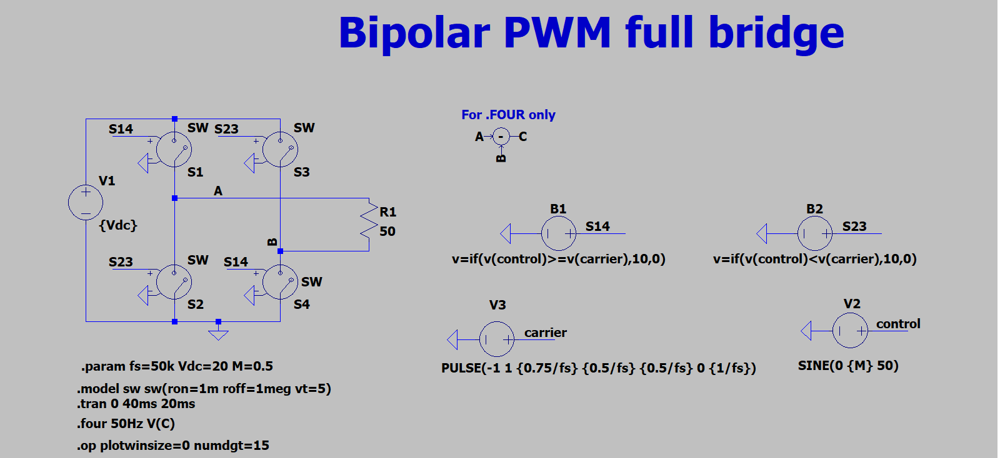
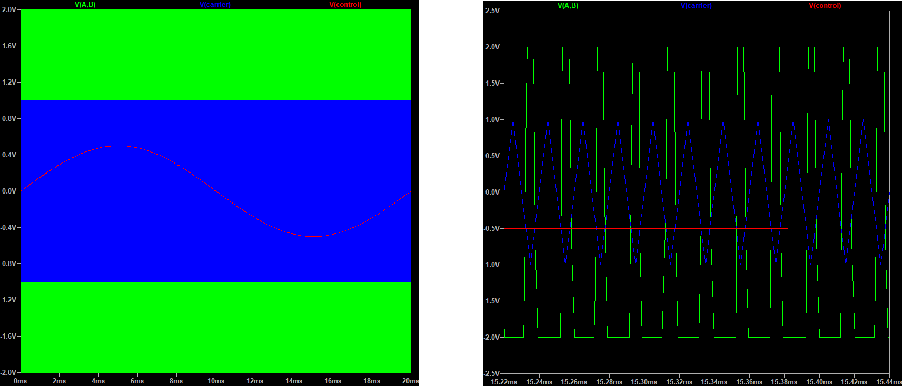
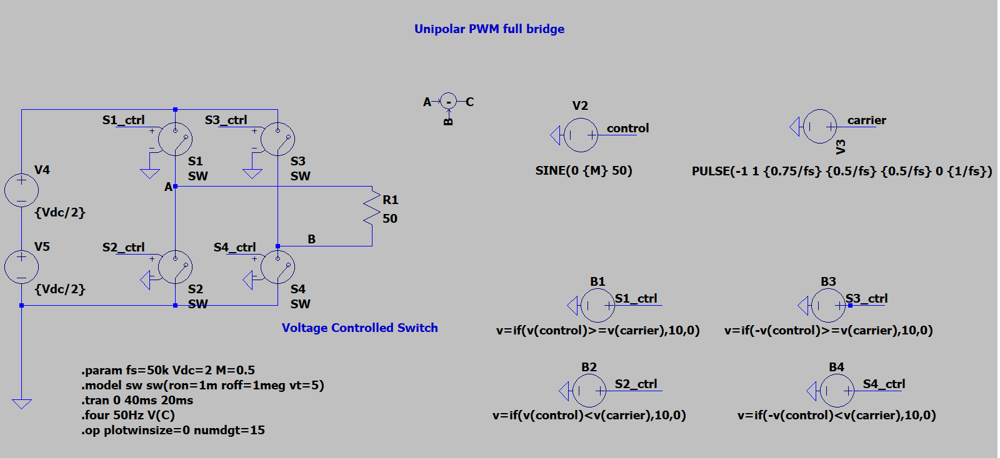
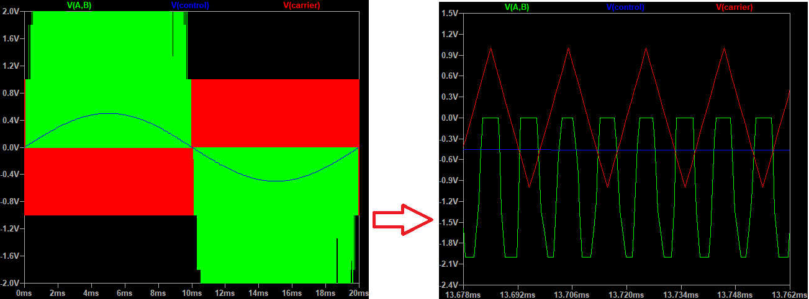
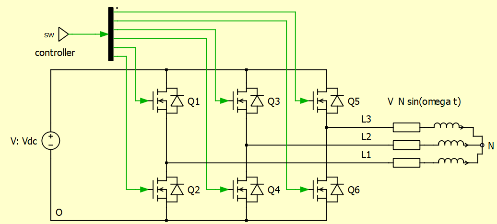

+++
title = "The fundamental of DC-AC inverter"
description = "Single-phase and three-phase PWM inverter."
date = 2022-01-13T09:19:42+01:00

[taxonomies]
categories = ["Power-Electronics"]
tags = ["DC-AC"]

[extra]
toc = true
math = true
math_auto_render = true
+++

Refer [^fn1] for more details.

## Getting started

Switch utilization

$$
\frac{P_o}{P_T} = \frac{V_{o1,max} \times I_{o1,max}}{q \times V_T \times I_T}
$$

Where

- $V_{o1,max}, I_{o1,max}$ are the maximum rated output voltage and current.
- $V_T, I_T$ are the peak voltage rating and peak current rating of a switching device.
- $q$ is the number of switches.

## 1. Full-brige inverters

TL;DR

- Unipolar by definition: having or oriented in respect to a single pole.
- Bipolar by definiton: having or involving the use of two poles or polarities.


$$
\begin{align*}
& \text{Control signal: } V_{control}(t) = 𝑀 \times sin(\omega t) \\
& \text{Carrier signal: } V_{tri}(t) =
\left\{\begin{matrix}
\cfrac{4}{T_{sw} t} \qquad t \in [0,\cfrac{T_{sw}}{4}] \cup [\cfrac{3T_{sw}}{4},T_{sw}] \\
-\cfrac{4}{T_{sw} t} +2 \qquad  t \in [\cfrac{T_{sw}}{4},\cfrac{3T_{sw}}{2}]
\end{matrix}\right. \\
& \text{Output peak voltage } V_{out} = M \times V_{DC}

\end{align*}
$$


Where:

- $M$ is mudulation index.
- $\omega$ is fundamental frequency.
- $f_{sw} = 1 / T_{sw}$ is switching frequency.

Refer to [^simu] for LTspice simulation instruction.

### 1.1. Biploar PWM

`S1` and `S4` turn on and turn off at the same time.

Simulation result:

### 1.2. Unipolar PWM

The inverter output voltage switches between either between $0 \rightarrow +Vd$ during half cycle and $0 \rightarrow -Vd$ half cycle of the fundamental frequency thus this scheme is called unipolar modulation.

### 1.3. Hybrid PWM

Refer to [^hpwm]

### References

- [^hpwm]: Lai, R.S. and Ngo, K.D., 1995. A PWM method for reduction of switching loss in a full-bridge inverter. *IEEE Transactions on Power Electronics*, *10*(3), pp.326-332.

## 2. Vector space and three-phase inverter

## 3. Power losses and heating design of an DC-AC inverter

Power losses of an inverter is defined as

$$
P_{Loss} = P_{in} - P_{out}
$$

We could measure the losses in two ways.

1. **Direct** measure $P_{in}$ and $P_{out}$. The stability of this method is difficult to achieve. A small variant in input or output could lead to a large error.
2. **Indrect** by using Calorimetric methos. Highest accuracy is achieved, but it is complicate to operate.

A alternative of measuring the losses is **deriving the losses**. The losses can be calculated by estimate of 4 types of power losses.

1. Switching losses
2. Conducting Losses
3. Blocking losses (neglecgable)
4. Driving losses (neglecable)

The rule of thumb for a good design is 50% of switching losses and 50% of conducting losses. Let take a closer look at the three-phase inverter.

$$
P_{conduction} = \frac{1}{2 \pi} \int_{0}^{2 \pi} v (\omega t) i (\omega t) dt
$$

Power switch is only conducting for half of period.


$$
\begin{align*}

& P_C^{IGBT} = \frac{1}{2 \pi} \int_{0}^{\pi} \left[ V_{CE,0} \cdot i_{IGBT}(\omega t) + R_{CE} \cdot i_{IGBT}^2 (\omega t) \right] dt \\
  
& P_C^{MOSFET} = \frac{1}{2 \pi} \int_0^{\pi} \left [ r_{ds} \cdot i_{MOS}^2 (\omega t) \right ] dt \\

& P_C^{Diode} = \frac{1}{2 \pi} \int_0^{\pi} \left [ V_{Forward} \cdot i_{diode} (\omega t) + R_F \cdot i_{diode}^2 (\omega t) \right] dt

\end{align*}
$$


$$
\text{Note: } V_{CE,0}, \; R_{CE}, \; R_{DS}, \;V_{F,0}, \; R_{F} \text{ are from the datasheets of Mosfet/IGBT/Diode.}
$$

Using Kirchhoff's current law, we have,

$$
i_{IGBT} (\omega t) + i_{Diode} (\omega t) = \hat{i}_N \; sin(\omega t)
$$

where:


$$
\begin{align*}

    & i_{IGBT}(\omega t) = m_{IGBT} (\omega t) \cdot \hat{i}_N \; sin(\omega t) \qquad (1) \newline
    & i_{Diode}(\omega t) = m_{Diode} (\omega t) \cdot \hat{i}_N \; sin (\omega t)

\end{align*}
$$


In case of Sine-triangle PWM modulation, modulation function $m = M \cdot sin(\omega t + \phi)$ with $M$ is modulation index.


$$
\begin{align*}
  
& m_{IGBT} - m_{Diode} = m \qquad (2) \\
& m_{IGBT} + m_{Diode} = 1

\end{align*}
$$


we have,


$$
\begin{align*}
  
&m_{IGBT} = \frac{1+m}{2} = \frac{1}{2} \left( 1 + M \cdot sin(\omega t) \right) \qquad (3) \\

&m_{Diode} = \frac{1-m}{2} = \frac{1}{2} \left( 1 - M \cdot sin(\omega t) \right)

\end{align*}
$$


Replace equation `(1)` by equation `(3)` we get,


$$
    i_{IGBT} (\omega t) = \frac{1}{2}  \left[ 1 + M \cdot sin(\omega t) \right]  \hat{i}_N \; sin(\omega t) \newline

    i_{Diode} (\omega t) = \frac{1}{2}  \left[ 1 - M \cdot sin(\omega t) \right]  \hat{i}_N \; sin(\omega t)
$$


Finally, we get the important formular for conduction losses.


$$
\begin{align*}

    & P^{IGBT}_{C} = \frac{\hat{i_N} \cdot V_{CE,0}}{2 \pi} \left( 1 + \frac{M \cdot \pi}{4} cos \phi \right) + \frac{R_{CE} \cdot \hat{i_N}^2}{2 \pi} (\frac{\pi}{4} + \frac{2M}{3} cos\phi) \newline
    & P^{MOS}_C = \frac{R_{DS} \cdot \hat{i_N}^2}{2 \pi} (\frac{\pi}{4} + \frac{2M}{3} cos\phi) \qquad (V_{CE,0} = 0) \newline
    & P^{Diode}_C = \frac{\hat{i_N} \cdot V_{F,0}}{2 \pi} \left( 1 - \frac{M \cdot \pi}{4} cos \phi \right) + \frac{R_{F} \cdot \hat{i_N}^2}{2 \pi} (\frac{\pi}{4} - \frac{2M}{3} cos\phi)

\end{align*}
$$


Since $R_{DS} \gg R_{CE}$, we could say that $P_C^{MOS}$ is not smaller than $P_C^{IBGT}$.

### Switching losses

$$
\begin{align*}
&  P_{SW,IGBT} = \frac{1}{\pi} f_{SW} (E_{on} + E_{off}) \frac{V_{DC}}{V_{ref}} \frac{\hat{i_N}}{i_{ref}} \\
&  P_{SW,Diode} = \frac{1}{\pi} f_{SW} E_{rec} \frac{V_{DC}}{V_{ref}} \frac{\hat{i_N}}{i_{ref}} \\
&  \text{ where } E_{rec} = \frac{1}{2} V_{rr} \times Q_{rr}
\end{align*}
$$

## 4. References

[^fn1]: David Perreault. *6.334 Power Electronics.* Spring 2007. Massachusetts Institute of Technology: MIT OpenCourseWare, [https://ocw.mit.edu](https://ocw.mit.edu/courses/electrical-engineering-and-computer-science/6-334-power-electronics-spring-2007). License: [Creative Commons BY-NC-SA](https://creativecommons.org/licenses/by-nc-sa/4.0/).

[^simu]: [Simulation of Bridge Inverter in LTspice](https://youtu.be/al6RyyJsOJo)

[MOSFET Power Losses Calculation Using the DataSheet Parameters](https://application-notes.digchip.com/070/70-41484.pdf)
