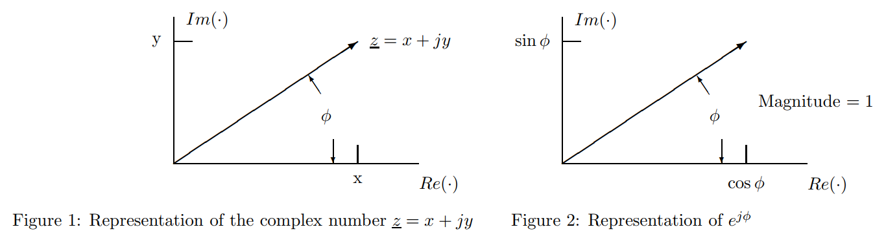
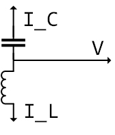
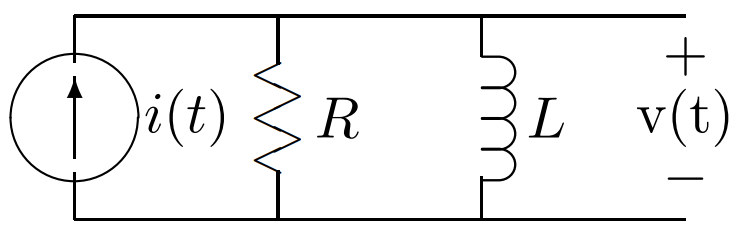
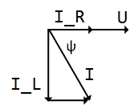

+++
title = "Complex number and its application in AC analysist"
description = "How to use complex number to simplify the AC circuit analysist"
date = 2022-02-10T09:19:42+01:00

[taxonomies]
categories = ["Power-Electronics"]
tags = ["Utility"]

[extra]
toc = true
math = true
math_auto_render = true
+++

## 1. Sinusoidal time functions and complex number

### 1.1. Complex number recap

Magnitude and phase angle of the complex number $\vec{z}$ is [^ref1]

⚠️ Note:⚠️ The author was used $\underline{z}$ to denote a vector. However, I am using $\vec{z}$ to do this because of my personal preference.


$$
|\vec{z}|=\sqrt{x^{2}+y^{2}} \qquad
\phi=\arctan \left(\frac{y}{x}\right)
$$


`Euler` relation


$$
e^{j \phi}=\cos (\phi)+j \sin (\phi) \qquad
\vec{z}=x+j y=|\vec{z}| e^{j \phi}
$$


The product and the ratio of two complex numbers are


$$
\vec{z}_{1}=\left|\vec{z}_{1}\right| e^{j \phi_{1}} \qquad
\vec{z}_{2}=\left|\vec{z}_{2}\right| e^{j \phi_{2}}
\qquad
\vec{z}_{1} \vec{z}_{2}=\left|\vec{z}_{1}\right|\left|\vec{z}_{2}\right| e^{j\left(\phi_{1}+\phi_{2}\right)}
\qquad
\frac{\vec{z}_{1}}{\vec{z}_{2}}=\frac{\left|\vec{z}_{1}\right|}{\left|\vec{z}_{2}\right|} e^{j\left(\phi_{1}-\phi_{2}\right)}
$$


The complex conjugate of a complex number is given by


$$
% <!-- markdownlint-disable-next-line MD049 -->
\vec{z}=x+j y \quad \vec{z}^{*}=x-j y \qquad
\vec{z}+\vec{z}^{*}=2 \operatorname{Re}(\vec{z})=2 x \qquad
\vec{z}-\vec{z}^{*}=2 j \operatorname{Im}(\vec{z})=2 j y
$$


### 1.2. Sinusoidal Time Functions

A sinusoidal function of time might be written in three ways


$$
f(t)=A \cos (\omega t+\phi) \qquad (1) \\
f(t)=B \cos (\omega t)+C \sin (\omega t) \qquad (2) \\
f(t)=\vec{X} e^{j \omega t}+\vec{X}^{*} e^{-j \omega t} \qquad (3)
$$


Equation `(3)` makes sure that that the resulting function is real. Now, let find out the relationship between equation `(1) and (3)`.

Let say


$$
\vec{X}=|\vec{X}| e^{j \psi}
$$


then


$$
% <!-- markdownlint-disable-next-line MD049 -->
f(t) =|\vec{X}| e^{j \psi} e^{j \omega t}+|\vec{X}|^{*} e^{-j \psi} e^{-j \omega t} =|\vec{X}| e^{j(\psi+\omega t)}+|\vec{X}|^{*} e^{-j(\psi+\omega t)} \\
f(t)=2|\vec{X}| \cos (\omega t+\psi)
$$


so we have


$$
|\vec{X}| =\frac{A}{2} \qquad \psi =\phi
$$


Next, finding the relationship between equation `(2) and (3)`.

Alternatively, we could write


$$
\vec{X}=x+j y
\qquad \text{where} \quad
x=|\vec{X}| \cos (\psi)
\qquad
y=|\vec{X}| \sin (\psi)
$$


thus


$$
f(t)=\vec{X} e^{j \omega t}+\vec{X}^{*} e^{-j \omega t} = x\left(e^{j \omega t}+e^{-j \omega t}\right)+j y\left(e^{j \omega t}-e^{-j \omega t}\right) \\
f(t) =2 x \cos (\omega t)-2 y \sin (\omega t)
$$


Finally, we get


$$
B = 2x \qquad C = -2y \qquad \vec{X} = \frac{B}{2} - j \frac{C}{2}
$$


### 1.3. Summary

Since


$$
% <!-- markdownlint-disable-next-line MD049 -->
(\vec{X} e^{j \omega t})^{*} = \vec{X}^{*} e^{-j \omega t}
$$


expression `(3) and (4)` are equivalent. It is advantageous to use one or the other of them, according to circumstances.  
It's easy to notice that $\vec{X}$ is time-independent. This conclusion is used when forming the relationship between voltage and current of inductor and capacitor elements.

| Sinusoidal form                            | Complex number form                                                                 | $\vec{X}$                       |
| ------------------------------------------ | ----------------------------------------------------------------------------------- | ------------------------------------- |
| $f(t)=A \cos (\omega t+\phi)$              | $f(t)=\vec{X} e^{j \omega t}+\vec{X}^{*} e^{-j \omega t} \quad (3)$     | $\vec{X}={A}/{2} \angle \phi$   |
| $f(t)=B \cos (\omega t)+C \sin (\omega t)$ | $f(t)=Re(2\vec{X} e^{j \omega t}) = Re(A e^{j \phi} e^{j \omega t})\quad (4)$ | $\vec{X} = {B}/{2} - j {C}/{2}$ |

**Strategy**:

1. Transform the input `In` into complex polar form $In \angle \phi$
2. Calculate impedance complex number $Z$
3. Transform output `Out` into polar form $O \angle \alpha$
4. Using expression `(4)` to find out $Out(t)$

## 2. Impedance

Consider two elements, inductances and capacitances.

| Inducatance    (L)                                                                                                           | Capacitance (C)                                                                                                                   |
| ---------------------------------------------------------------------------------------------------------------------------- | --------------------------------------------------------------------------------------------------------------------------------- |
|                                                                                       |                                                                                           |
| Current is `lagging` voltage. (`L` means _Lower_ :arrow_lower_right:)                                                        | Current is `leading` voltage                                                                                                      |
| $v_L = L {di}/{dt}$                                                                                                          | $i = C \; {dV_C}/{dt}$                                                                                                            |
| $v = \vec{V}e^{j \omega t} + \vec{V}^{*} e^{-j \omega t}$                                                        | $i = \vec{I}e^{j \omega t} + \vec{I}^{*} e^{-j \omega t}$                                                             |
| $\vec{V}=j \omega L \vec{I} = \vec{Z}_L \; \vec{I} \quad \text{where } \vec{Z}_L = j \omega L$ | $\vec{I}=j \omega C \vec{V} = \vec{V} / \vec{Z}_C \quad \text{where } \vec{Z}_C = 1 / (j \omega C)$ |

The inverse of impedance is **admittance**


$$
\vec{Y} = 1/ \vec{Z}
$$


### Example

Suppose we are to find the voltage $v(t)$ in the network, in which $i(t) = I cos(\omega t)$

`Step 1.` Transform the input `In` into complex polar form $In \angle \phi$


$$
i(t) = Re(I e^{\omega t})
$$


`Step 2.` Calculate impedance complex number
$$
Z _\| = \frac{R j \omega L}{R + j \omega L} = \frac{R \omega L}{\sqrt{R^2 + (\omega L)^2}} \angle (arctan \frac{R}{\omega L})
$$

`Step 3.` We found the output voltage in the polar-exponential form

$$
V = Z_\| I = \frac{IR \omega L}{\sqrt{R^2 + (\omega L)^2}} \angle (arctan \frac{R}{\omega L})
$$

`Step 4.` Using expression `(4)` to find out $v(t)$

$$
v(t) = \frac{IR \omega L}{\sqrt{R^2 + (\omega L)^2}} cos ( \omega t + arctan \frac{R}{\omega L})
$$

## References

[^ref1]: James Kirtley Jr.. _6.061 Introduction to Electric Power Systems._ Spring 2011. Massachusetts Institute of Technology: MIT OpenCourseWare, [https://ocw.mit.edu](https://ocw.mit.edu/courses/electrical-engineering-and-computer-science/6-061-introduction-to-electric-power-systems-spring-2011). License: [Creative Commons BY-NC-SA](https://creativecommons.org/licenses/by-nc-sa/4.0/).
