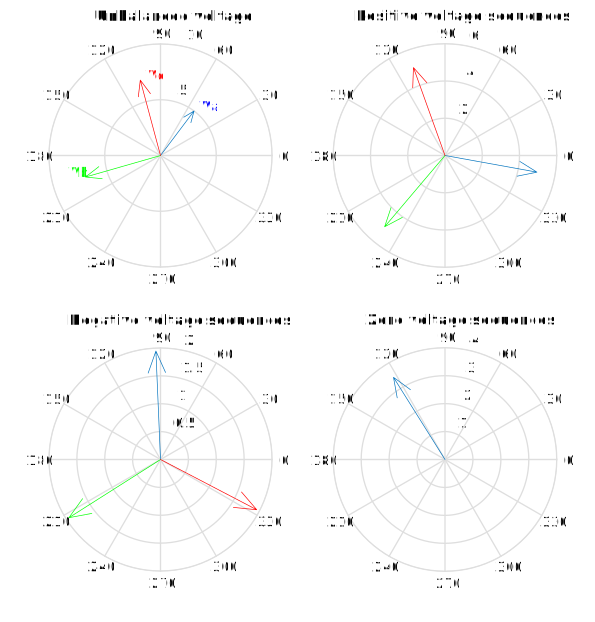
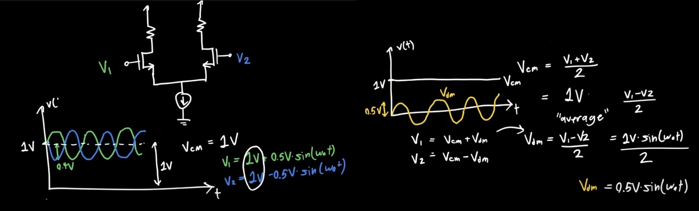
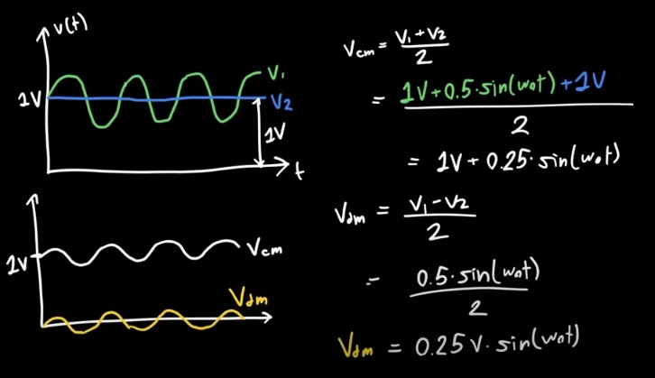
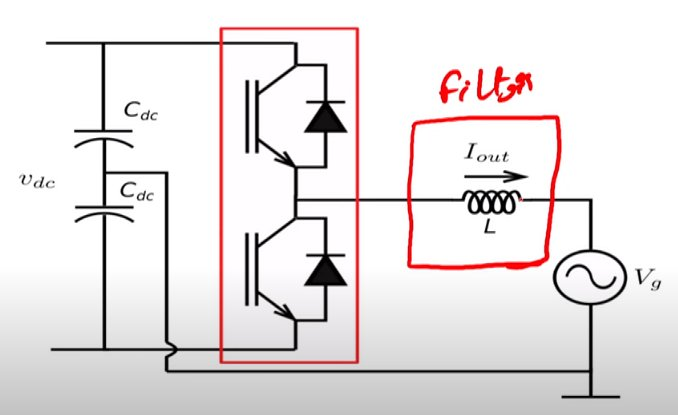
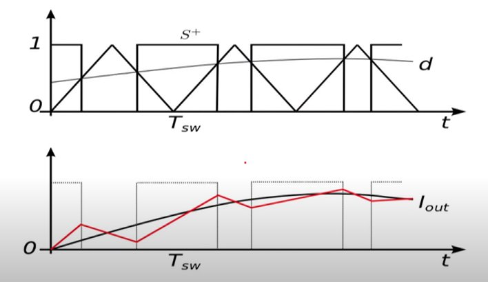

+++
title = "Control of grid connected inverter"
description = "Fundamental of grid connected inverters."
date = 2022-02-24T09:19:42

[taxonomies]
categories = ["Power-Electronics"]
tags = ["grid"]

[extra]
toc = true
math = true
math_auto_render = true
+++


## 1. Fundamental terminologies

### 1.1. Power

The instantaneous electrical power P delivered to a component is given by


$$
P(t)=I(t)\cdot V(t)
$$


where

- $P(t)$ is the instantaneous power, measured in watts (joules per second)
- $V(t)$ is the potential difference (or voltage drop) across the component, measured in volts
- $I(t)$ is the current through it, measured in amperes

The average power is


$$
P_{\mathrm {avg}} = {\frac {1}{T}}\int_{0}^{T}p(t)\mathrm {d} t
$$


### 1.2. What is postitive, negative and zero sequence?

These components are so-called **symmetrical components** [^ref1].

⚠️ Note:⚠️ The author was used $\underline{z}$ to denote a vector. However, I am using $\vec{z}$ to do this because of my personal preference.

Symmetrical components allow unbalanced phase quantities such as currents and voltages to be replaced by three separate balanced symmetrical components

The transformation is defined as:


$$
\begin{bmatrix}
\vec{V}_+  \\
\vec{V}_-  \\
\vec{V}_0  \\
\end{bmatrix}

= \frac{1}{3}

\begin{bmatrix}
1 & \vec{a} & \vec{a}^2  \\
1 & \vec{a}^2 & \vec{a} \\
1 & 1 & 1 \\
\end{bmatrix}

\begin{bmatrix}
\vec{V}_a  \\
\vec{V}_b  \\
\vec{V}_c  \\
\end{bmatrix}

\qquad \text{ where } \vec{a} = e^{j 2 \pi /3}
$$


The invert transformation is:


$$
\begin{bmatrix}
\vec{V}_a  \\
\vec{V}_b  \\
\vec{V}_c  \\
\end{bmatrix}

=

\begin{bmatrix}
1 & 1 & 1  \\
\vec{a}^2 & \vec{a} & 1 \\
\vec{a} & \vec{a}^2 & 1 \\
\end{bmatrix}

\begin{bmatrix}
\vec{V}_+  \\
\vec{V}_-  \\
\vec{V}_0  \\
\end{bmatrix}
$$


Let take an example. Obtain the symmetrical components of a set of unbalanced voltage.


$$
\vec{V_a} = 5 \angle 53 ^{\circ} \qquad \vec{V_b} = 7 \angle -164 ^{\circ} \qquad \vec{V_c} = 7 \angle 105 ^{\circ}
$$


Run this Matlab script to get the result.

```matlab
classdef lib
    methods (Static = true)
        function [v_out_theta, v_out_rho] = sym_components_theory  (va, vb, vc, isRadian)
            %% Symmetrical Components Theory
            % va: Unbalanced phase A voltage
            % vb: Unbalanced phase B voltage
            % vc: Unbalanced phase C voltage
            %
            % v_out_theta_d: Output theta in degree/radian (polar form)
            % v_out_rho: Output radius (polar form)
            % ┌─   ─┐       ┌─       ─┐ ┌─ ─┐
            % │V_pos│ = 1/3 │1 α   α^2│ │V_a│
            % │V_neg│       │1 α^2 α  │ │V_b│
            % │V_0  │       │1 1   1  │ │V_c│
            % └─   ─┘       └─       ─┘ └─ ─┘
            arguments
                va
                vb
                vc
                isRadian uint8 = 0
            end
         
            rho = 1;
            theta = 2 * pi /3;
            alpha = rho * exp (1i * theta);
            a_tran = 1 /3 * [1 alpha alpha^2; 1 alpha^2 alpha; 1 1 1];

            v = [va; vb; vc];
            v_out = a_tran * v;
            [v_out_theta, v_out_rho] = cart2pol(real(v_out), imag(v_out));
            if (isRadian == 0)
                v_out_theta = 180* v_out_theta / pi;
            end
        end
    end
end
```

```Matlab
%% symmetrical components
clc;
clear;
% Input
va = 5 * exp(1i*53/180*pi);
vb = 7 * exp(1i* (-164)/180*pi);
vc = 7 * exp (1i* 105/180 * pi);

% result is in Degree unit
fprintf("Output in V+ V- Vzero order. \n");
[v_out_theta_d, v_out_rho] = lib.sym_components_theory  (va, vb, vc);
fprintf("Radius: \n"); disp(v_out_rho);
fprintf("Phase [Degree]: \n"); disp(v_out_theta_d);

% Draw complex number
v_sym = v_out_rho .* exp (1i * v_out_theta_d/180 * pi);
v_zero = v_sym(1);
v_pos = v_sym (2);
v_neg = v_sym (3);

t = tiledlayout(2,2);
t.Padding = 'compact';
t.TileSpacing = 'compact';

% unbalanced voltage
z = [va, vb, vc];
nxt = nexttile;
c = compass(nxt, real(z), imag(z));
title(nxt,'Unbalanced voltage')

text(real(va) + 0.5, imag(va) + 0.5, 'Va', Color='b')

c_b = c(2);
c_b.Color = 'g'; % V_b is green
text(real(vb) - 1.5, imag(vb) + 0.5, 'Vb', Color='g')
c_c = c(3);
c_c.Color = 'r'; % V_c is red
text(real(vc) + 0.5, imag(vc) + 0.5, 'Vc', Color='r')

% positive voltage sequence
z_pos = [v_pos; v_pos * exp(1i * (-2) * pi / 3); v_pos * exp(1i * (-4) * pi / 3)];
nxt = nexttile;
c_pos = compass(nxt, real(z_pos), imag(z_pos));
title(nxt,'Positive voltage sequences')
c_pos_b = c_pos(2);
c_pos_b.Color = 'g'; % V_b is green
c_pos_c = c_pos(3);
c_pos_c.Color = 'r'; % V_c is red

%negative voltage sequency
z_neg = [v_neg; v_neg * exp(1i * (-4) * pi / 3); v_neg * exp(1i * (-2) * pi / 3)];
nxt = nexttile;
c_neg = compass(nxt, real(z_neg), imag(z_neg));
title(nxt,'Negative voltage sequences')
c_neg_b = c_neg(2);
c_neg_b.Color = 'g'; % V_b is green
c_neg_c = c_neg(3);
c_neg_c.Color = 'r'; % V_c is red

% Zero sequences
nxt = nexttile;
c_zero = compass(nxt, real(v_zero), imag(v_zero));
title(nxt,'Zero voltage sequences')

%----------------------------------------------------
%% Unbalanced current
ia = 10;
ib = 10 * exp(1i* (-2)/3*pi);
ic = 0;
[i_out_theta_d, i_out_rho] = lib.sym_components_theory  (ia, ib, ic, 0)
```



We get $V_+, V_-, V_0$ magnitude and phase accordingly.

```matlab
Output in V+ V- Vzero order. 
Radius: 
    5.0156
    1.9469
    3.4718

Phase [Degree]: 
  -10.2643
   92.4259
  122.0788
```

or, it could be written in the time domain form.


$$
\begin{align*}
& v_a = 5.02 sin (\omega t - 10)      & &+ 1.95 sin (\omega t + 92)        & &+ 3.5 sin (\omega t + 122) \\
& v_b = 5.02 sin (\omega t - 10 - 120) & &+ 1.95 sin (\omega t + 92 - 240) & &+ 3.5 sin (\omega t + 122) \\
& v_c = \underbrace{5.02 sin (\omega t - 10 - 240)}_{\text{positive seq.}} & &+ \underbrace{ 1.95 sin (\omega t + 92 - 120)}_{\text{negative seq.}} & &+ \underbrace{3.5 sin (\omega t + 122)}_{\text{Zero seq.}} \\
\end{align*}
$$


### 1.3. Differential and Common Mode Signals



An other example.



### 1.4. References

- [^ref1]: James Kirtley Jr.. _6.061 Introduction to Electric Power Systems._ Spring 2011. Massachusetts Institute of Technology: MIT OpenCourseWare, [https://ocw.mit.edu](https://ocw.mit.edu/courses/electrical-engineering-and-computer-science/6-061-introduction-to-electric-power-systems-spring-2011/readings/MIT6_061S11_ch4.pdf) License: [Creative Commons BY-NC-SA](https://creativecommons.org/licenses/by-nc-sa/4.0/).
- [Calculate Powers in Non-sinusoidal Conditions According to IEEE 1459](http://nazarovsky.ru/2015/02/25/powers-according-to-ieee1459/)
- [Differential and Common Mode Signals](https://youtu.be/s1_Siu3prRQ)

## 2. Filter design

### 2.1. L filter





### 2.2. References

- [AC filters for grid connected inverters](https://nptel.ac.in/courses/108108034) in Power electronic design.
- [Three-phase grid converter control: video 1 Grid tied inverters](https://youtu.be/rE-goTuAIvk)

## 3. Phase-locked loop

### References

- https://dsp.stackexchange.com/q/75492
- [Three-phase grid converter control: video 3 Phase lock loops](https://bit.ly/3LiT8bH)
