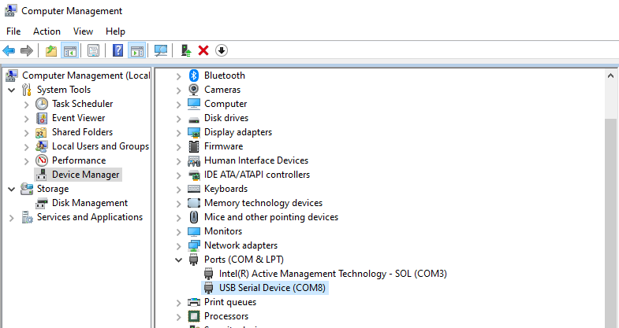
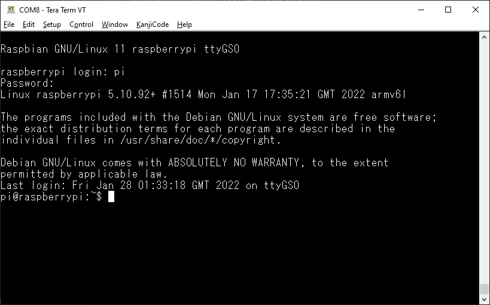

+++
title = "Serial protocol through USB on Raspberry Pi"
description = "Quick way to enable serial protocol through USB connection."
date = 2022-03-02T09:19:42+01:00

[taxonomies]
categories = ["Raspberry-Pi"]
tags = ["Pi-Zero"]

[extra]
toc = true
math = true
math_auto_render = true
+++


## 1. Download Raspberry Pi OS

I am using the lite version at [2022-01-28-raspios-bullseye-armhf-lite image](https://downloads.raspberrypi.org/raspios_lite_armhf/images/raspios_lite_armhf-2022-01-28/2022-01-28-raspios-bullseye-armhf-lite.zip)

```bash
cat /boot/config.txt
[all]
# Enable UART via PIN IO
enable_uart=1
dtoverlay=dwc2
```

## 2. Raspberry Pi settings

You need to change `/boot/cmdline.txt` file as follows.

```bash
$ cat /boot/cmdline.txt
console=serial0,115200 console=tty1 root=PARTUUID=22e47bc0-02 rootfstype=ext4 fsck.repair=yes rootwait modules-load=dwc2,g_serial
```

Default username/password: `pi/raspberrypi`. Entering sudo mode `sudo su`

```bash
systemctl enable getty@ttyGS0.service
systemctl start getty@ttyGS0.service
systemctl is-active getty@ttyGS0.service
```

Reboot your Raspberry Pi to apply these settings.

```bash
reboot
```

If everything is good, we'll see a new `USB Serial Device` under **Ports (COM & LPT)** as following picture.



Teraterm login via USB.



## 3. References

- [Configuring the Pi Zero USB port as a serial device - mike632t](https://mike632t.wordpress.com/2020/03/30/configuring-the-pi-zero-usb-port-as-a-serial-device/)
- [Serial Gadget - adafruit](https://learn.adafruit.com/turning-your-raspberry-pi-zero-into-a-usb-gadget/serial-gadget)
