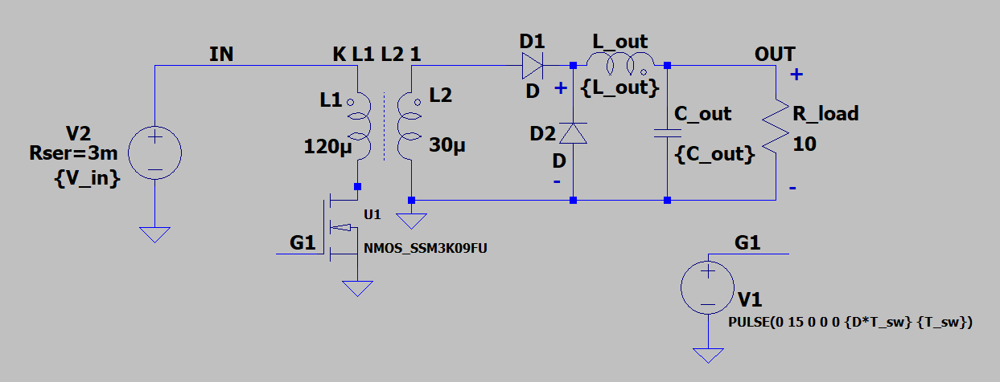
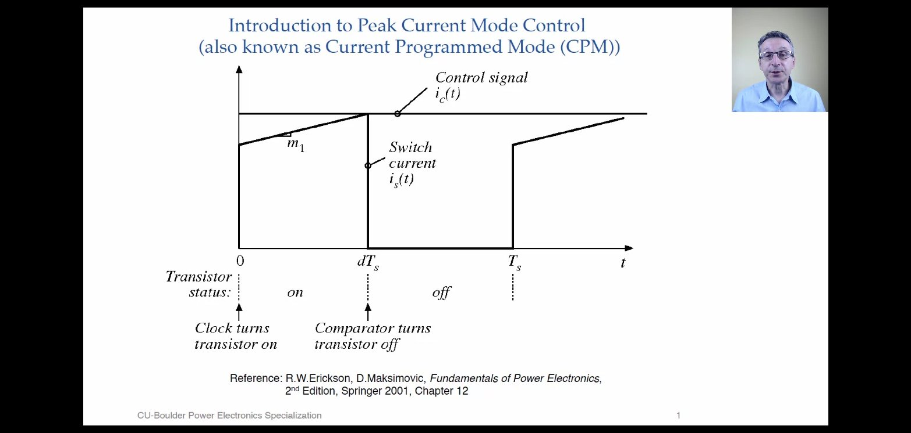
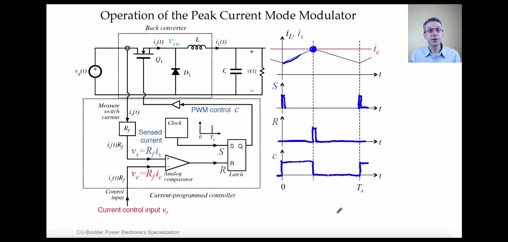
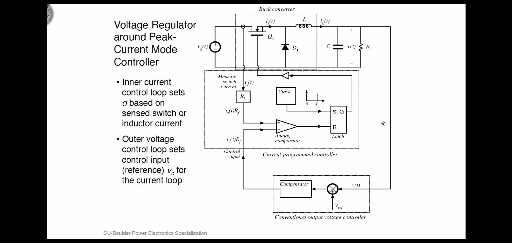
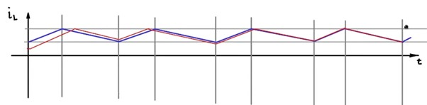
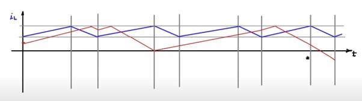
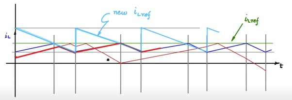
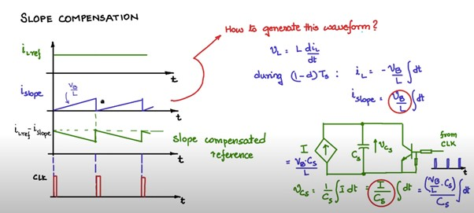
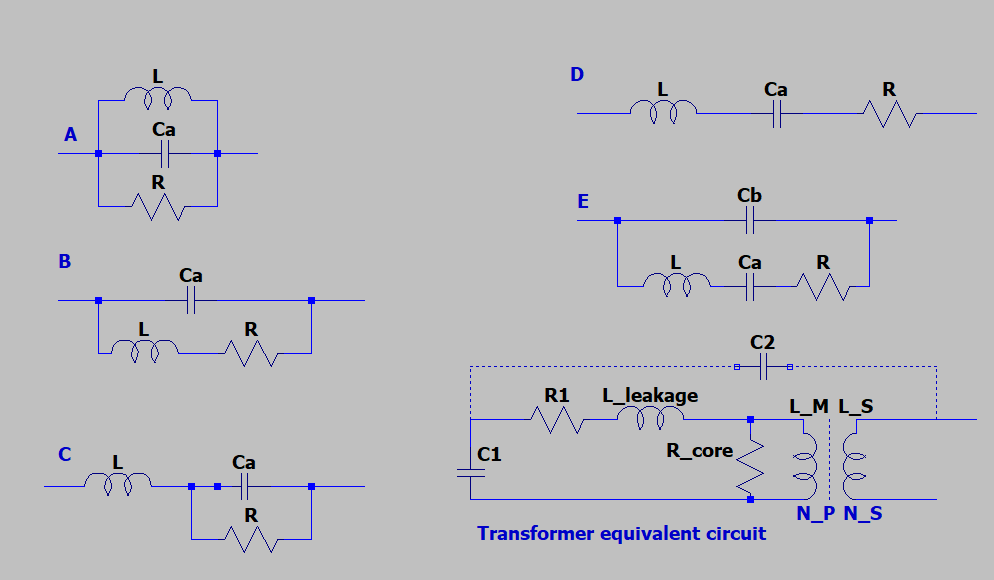

+++
title = "AC/DC to DC converter"
description = "Basic AC to DC converter topologies."
date=2022-03-31

[taxonomies]
categories = ["Power-Electronics"]
tags = ["AC-DC"]

[extra]
toc = true
math = true
math_auto_render = true
+++

If you don't know what is `K1 L1 L2 1` transformer directive means, you should check [^lt_transf] for more details.

## 1. Forward converter

### 1.1. One-switch sigle-ended forward converter (isolated buck converter)

This is essentially a buck converter with transformer inserted.

We want to operate in Continuous Conduction Mode.
$I_{Lout}$ never reach zero.

In DCM we may have `peak detect` phenomina, we $V_{out}^{'} = (3-4) \times V_{out}$


$$
\begin{align*}
& \text{- switch on: } V_{D2} = \frac{N2}{N1} V_{in} \\
& \text{- switch off: } V_{D2} = 0; \\
& \frac{V_{OUT}}{V_{IN}} = \frac{N2}{N1} D
\end{align*}
$$



$$
\text{Output voltage ripple } V_{ripple} = ESR * \Delta I
$$


ESR is from $C_{OUT}$, and $\Delta I$ is effected by the design of $L_{out}$.
Rule of thumb is $\Delta I$ = 10% to 40% of full load.

Refer [^fn1] for more details.

### 1.2. Two-switch sigle-ended forward converter (isolated buck converter)

also called asymmetrical half bridge forward

## 2. Flyback converter

Transfer function [^ti_flyback] is


$$
\begin{align*}
  \frac{V_{out}}{V_{in}} = n \times \frac{D}{1 - D}
\end{align*}
$$


where $n$ is turn ration, and $D$ is duty cycle.

### 2.1. RCD Clamp

- See more at [RCD Clamp](https://youtu.be/rmMYgnJ1oqE)

## 3. Peak current control mode (Current-Programmed Control)

UCC28C42 from TI using this control method.

Refer to chapter 18 of [^erickson2007], and [^dragan].

## 4. Slope compensation

Refer to [^slope] for more information.

|  |
| :------------------------------------------------------: |
|              D<50% turburlance is faded out              |

If Duty cycle $D>50\%$, $I_L$ with turburlance is not stable.

Using new $I_{Lref}$ to solve the problem.

How to generate the new $I_{Lref}$?

## 5. Practical consideration

### 5.1. How to use Impedance Analyzer

The table is adapted from [^4191A].

| Equi. circuit | Type of DUTs                                                                                                                                        |
| ------------- | --------------------------------------------------------------------------------------------------------------------------------------------------- |
| A             | (1) Coils with high core loss; (2) To measure magnetizing inductance $L_M$, you need to open the secondary side. Only $L_M,C_1,R_{core}$ were left. |
| B             | (1) coils in general; (2) resistors; (3) Measuring leakage inductance $L_{leakage}$, you need to short the secondary side.                          |
| C             | High value resistors                                                                                                                                |
| D             | Capacitors                                                                                                                                          |
| E             | Resonators (crystal, ceramic, ferrite)                                                                                                              |

---

Pending

- https://archive.nptel.ac.in/course.html
- [NOC:Fundamental of Power Electronics (Video)](https://archive.nptel.ac.in/courses/108/101/108101126/)
  - Week 12
    - Intro for close loop control
    - Close looping dc-dc converters
    - Simulation of close loop control
    - Current control for battery charger application
    - Instability in current control and slope compensation
    - Slope compensated current control
    - Simulation of current control
    - Single phase inverter with sinusoidal pwm
    - Simulation of sinusoidal PWM
- [NOC:Control and Tuning Methods in Switched Mode Power Converters](https://archive.nptel.ac.in/courses/108/105/108105180/)
  - Week 02
    - Lecture 12 : Interactive MATLAB Simulation and Case Studies

## 6. References

- [^fn1]: David Perreault. *6.334 Power Electronics Ch. 7.* Spring 2007. Massachusetts Institute of Technology: MIT OpenCourseWare, [https://ocw.mit.edu](https://ocw.mit.edu/courses/electrical-engineering-and-computer-science/6-334-power-electronics-spring-2007). License: [Creative Commons BY-NC-SA](https://creativecommons.org/licenses/by-nc-sa/4.0/).
- [^lt_transf]: [LTspice: Simple Steps for Simulating Transformers](https://www.analog.com/en/technical-articles/ltspice-basic-steps-for-simulating-transformers.html)
- [^4191A]: Operation manual Model 4191A network/spectrum Analyzer page 141/356 [Online](https://xdevs.com/doc/HP_Agilent_Keysight/HP%204195A%20Operation.pdf)
- [^erickson2007]: Erickson, R. W. & Maksimovic, D. 2007. Fundamentals of power electronics, Springer Science & Business Media.
- [^dragan]: Current-Mode Control, Dr. Dragan Maksimovic - University of Colorado Boulder [Online](https://www.coursera.org/lecture/current-modecontrol/introduction-to-peak-current-mode-control-nbIZQ)
- [^slope]: Slope compensation for current control - NPTEL [Online](https://youtu.be/b3e0RTWt4W0)
- [^ti_flyback]: AC Modeling of Power Stage in Flyback Converter - Texas Instruments [Online](https://www.ti.com/lit/an/slva589/slva589.pdf)
  