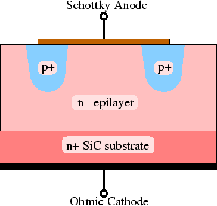

+++
title = "Materials, Reliability and Failure Analysis"
description = "Meterial science and testing"
date = 2022-05-11T09:19:42+01:00

[taxonomies]
categories = ["Power-Electronics"]
tags = ["Materials"]

[extra]
toc = true
math = true
math_auto_render = true
+++

Kinetic thermal energy
$$
K_{kin} = \frac{m}{2}v_{th}^2 = \frac{3}{2}kT
$$

When an electric field $E$ is applied, each carrier (i.e. electrons and holes) experiences a force $± q \times E$ and is accelerated. These velocities caused by the external electrical field $E$ are called **drift velocities** [^fn-drift].

The current density $J$, or the current flow of electrons per unit volume, is given by the following:

$$
\begin{align*}
J_n &= nqv_d \newline
J_n &= nq\dfrac{1}{2} \dfrac{q\tau}{m^{2}}E
\end{align*}
$$

Electron mobility $\mu_n$ is the ratio of drift velocity to the electric field strength.

$$
\mu_n = \dfrac{\nu_d}{E} = \dfrac{q \tau}{m^*}
$$

## Hight voltage Shottky diode

- Anisotropic: Sic, GaN. Mobility are different in parallel $\mu_{\parallel}$ and perpendicular $\mu_{\perp}$ direction.
- Phonons: lattice vibration
- Scattering: small amount of things spread over an area.
- More dopping --> more phonons --> $\mu_{n} \downarrow$ and desisty $\downarrow$. However, in combination with thickness and doping density --> Wide Bandgap semiconductors have lower conduction losses.
- Shottky diode: $E_{max}$ at the contact semiconductor and metal or P-N junction.
  - Merged PiN Schottky Diodes (MPS) structure: reduce electrical field stress
- "Trench Oxide Pin Schottky" (TOPS): reduce contact between metal and semiconductor --> prevent the migration of carriers at the anode (metal). The rest of structure is the same as MPS [^fn-luz].
- Soft recovery. Soft factor $s = \cfrac{t_f}{t_s} \gt 0.8$

|                                                                                                                        |       |
| :--------------------------------------------------------------------------------------------------------------------: | :---: |
|  |
|                            Cross section of a merged pin Schottky diode in SiC [^fn-ayalew]                            |

## References

[^fn-drift]: [4: Carrier Drift and Mobility](https://eng.libretexts.org/Bookshelves/Materials_Science/Supplemental_Modules_(Materials_Science)/Solar_Basics/C._Semiconductors_and_Solar_Interactions/II._Conduction_in_Semiconductors/4:_Carrier_Drift_and_Mobility)

[^fn-luz]: Lutz, J., Schlangenotto, H., Scheuermann, U. and De Doncker, R., 2011. Semiconductor power devices. Physics, characteristics, reliability, 2.

[^fn-ayalew]: [SiC Semiconductor Devices Technology, Modeling, and Simulation](https://www.iue.tuwien.ac.at/phd/ayalew/)
