+++
title = "Miscellaneous"
description = "Uncategorized notes."
date = 2022-05-19T09:19:42+01:00

[taxonomies]
categories = ["Power-Electronics"]
tags = ["misc"]

[extra]
toc = true
math = true
math_auto_render = true
+++

# General information

## Connector

Blade connectors (lower half of photo). Ring and spade terminals (upper half). Bullet terminals, male and female (right-center, with blue wires)

|  |
| :---------------------------------------------: |
|                 Blade connector                 |

| 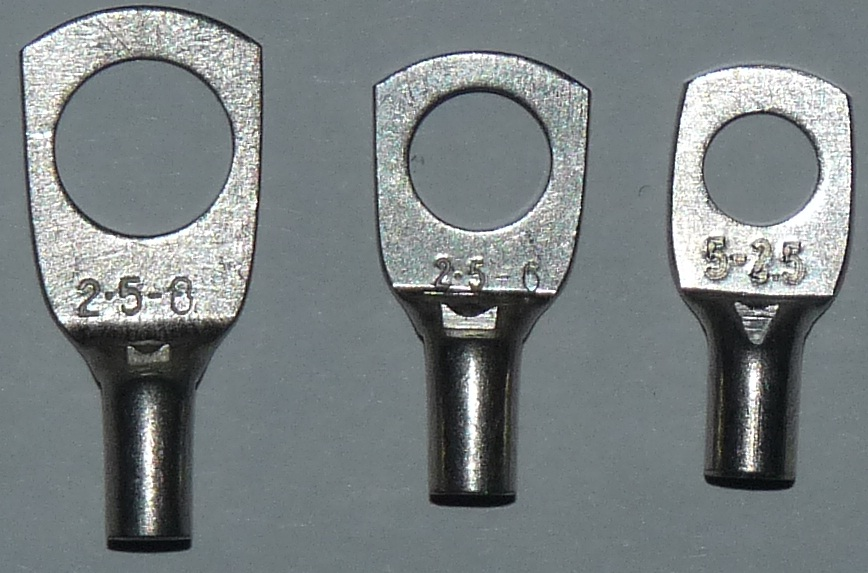 |
| :-----------------------------------------------------: |
|     Split-ring or lugs terminals for 2.5 mm² wire.      |

| 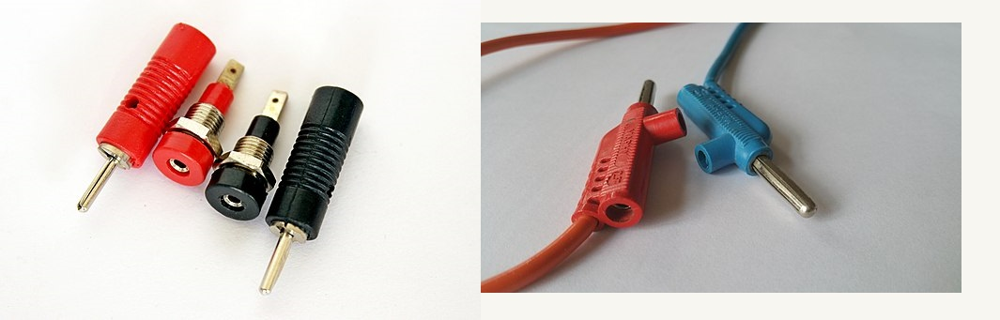 |
| :---------------------------------------------------------: |
|                    Banana jack connector                    |

Using crimping tool to join wire to the connector.

| 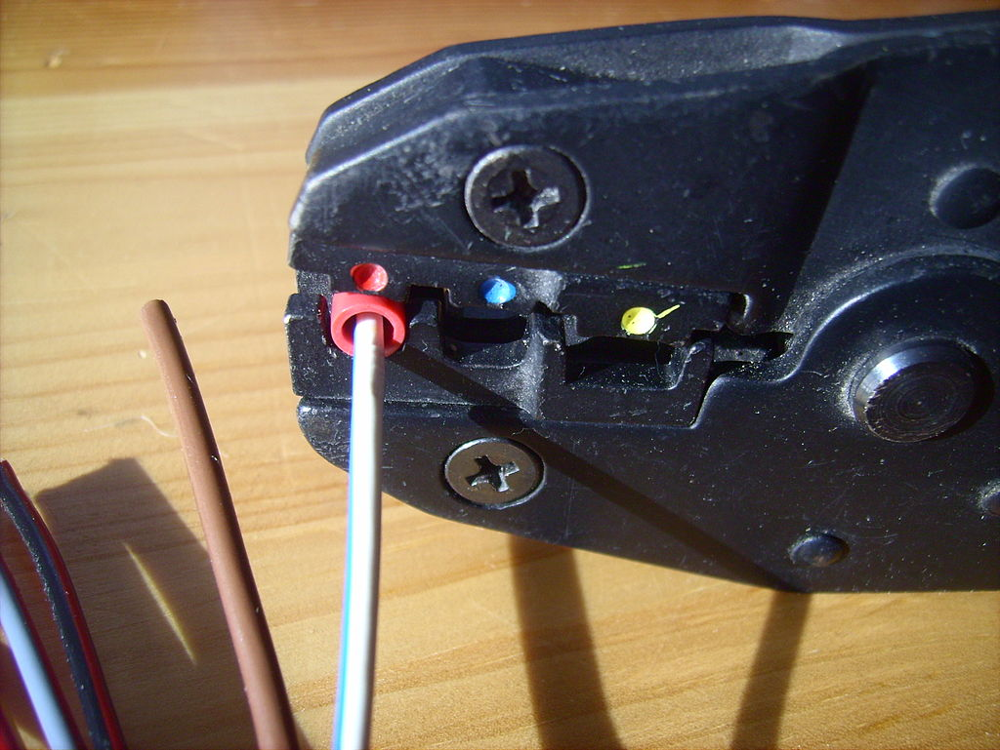 |
| :----------------------------------------: |
|               Crimping tool                |

## Power factor

| 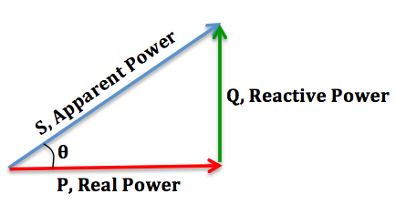 |
| :----------------------------------------------------------: |
|        Apparent power, reactive power and real power         |

The picture shows the relationship between "Apparent Power", "Reactive Power" and "Real Power".

- Reactive power is an AC power flow through the operation of the inductors and capacitors. This kind of power doesn't contribute to the

See more at [What is the role of reactive power in transmission networks?](https://www.reddit.com/r/askscience/comments/90q7i7/comment/e2sc27o/?utm_source=share&utm_medium=web2x&context=3)

## Interfacing Matlab Simulink with Plexim PLECS



## Potentiometers

[P16NP504KAB15 Vishay / Sfernice | Mouser Denmark](https://www.mouser.dk/ProductDetail/Vishay-Sfernice/P16NP504KAB15?qs=sGAEpiMZZMtC25l1F4XBU4GDvGXyUw%2BkUqAGoVe0N3c%3D)

There's a *LOT* of files on the official LTwiki.

For potentiometers look in ([source](https://www.eevblog.com/forum/eda/is-there-an-updated-massive-open-source-style-library-for-ltspice/)):

- http://ltwiki.org/files/LTspiceIV/lib/sym/Pot&Sw/ for the symbols, and
- http://ltwiki.org/files/LTspiceIV/lib/sub/Pote.lib is the associated library, (including both potentiometer_standard.lib and potentiometer_tapped.lib with documentation and sample files at
- http://ltwiki.org/files/LTspiceIV/examples/LtSpicePlus/Discretos/Sw&Pote/

# MOSFET

## N-channel MOSFET

### Physical view

Current flows between diffusion terminals if the voltage on the `Gate` large enough to create a **conducting channel**, otherwise the MOSFET is off and the diffusion terminals are not connected. [^ref1]

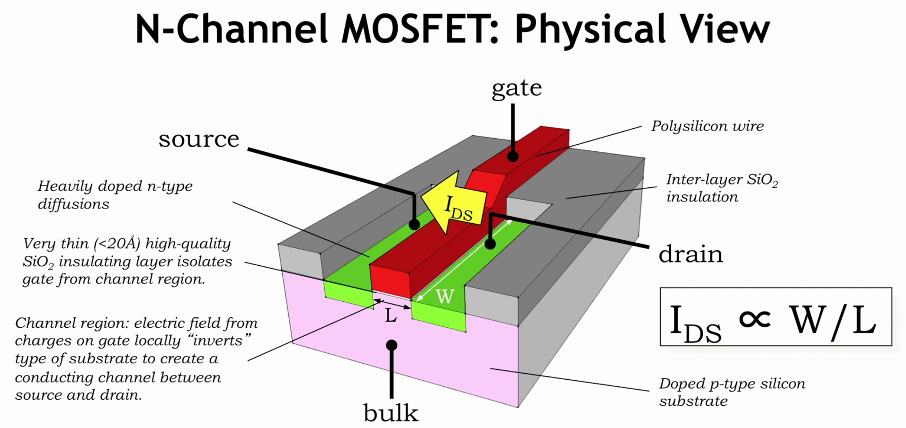

### Electrical view

The four terminals of a Field Effect Transitor are `Gate`, `Source`, `Drain` and `Bulk`.

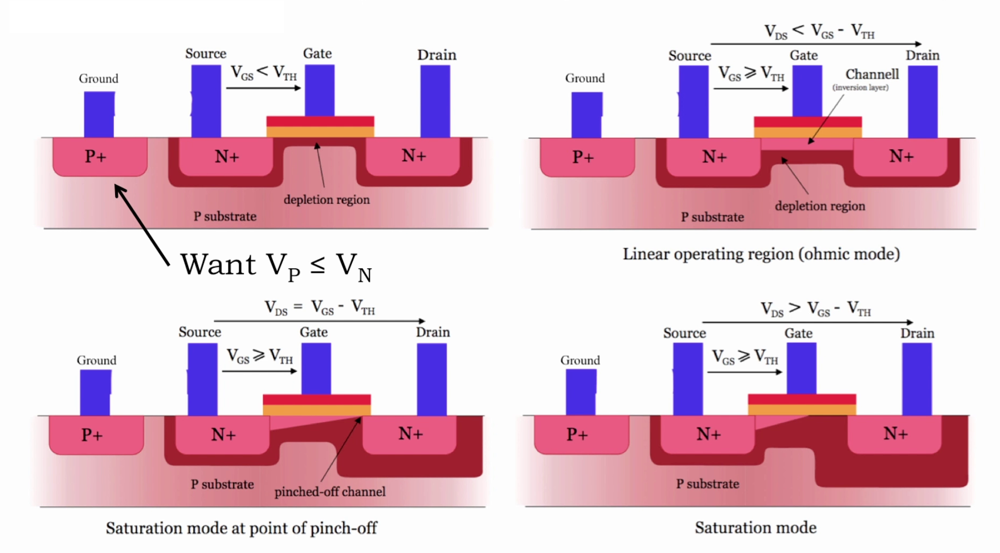

### Circuit symbol

MOSFET and JFET circuit symbols

| P-channel |  |  |  |  |  |
| :-------: | :----------------------------------------------------: | :----------------------------------------------------: | :---------------------------------------------------------------: | :----------------------------------------------: | ------------------------------------------------------ |
| **N-channel** |  |  |  |  |  |
|           |         JFET (they are only in depletion mode)         |                MOSFET enhancement mode                 |                 MOSFET enhancement mode (no bulk)                 |        MOSFET enhancement mode (no bulk)         | MOSFET depletion mode (switched on)                                  |



When a channel exists in a MOSFET, current can flow from source to drain as well as from drain to source - it's just a matter of how the device is connected in the circuit [^ref2]. Conventional current flows from Drain to Source in an N Channel MOSFET.

### N-channel MOSFET

When a channel exists in a MOSFET, current can flow from **drain to source** *or* from **source to drain** - it's a function of how the device is connected in the circuit. The conduction channel has no intrinsic polarity - it's kind of like a resistor in that regard.

The intrinsic body diode inside the MOSFET is in parallel with the conduction channel, however. When the conduction channel is present, the diode is shunted and current flows through the path of least resistance (the channel). When the channel is off, the diode is in circuit and will either conduct or block depending on the drain-source current polarity.

As your picture shows, there are both N-channel and P-channel devices, as well as enhancement mode and depletion mode devices. In all of these cases, current can flow from **source to drain** as well as from **drain to source** - it's just a matter of how the device is connected in the circuit.

Your picture does *not* show the intrinsic diode in the devices - the arrow point towards or away from the gate is an indication of the channel type (N-channel points towards the gate, P-channel points away from the gate).

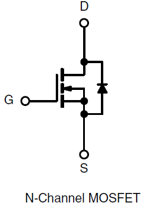

This symbol shows you the inherent diode between drain and source.

N-channel enhancement devices need a voltage on the gate *higher* than the source in order to create a conduction channel. (Enhancement devices don't have a channel automatically, and need gate voltage to create one - because it's N-channel Vgate>Vsource for this to happen.)

P-channel enhancement devices need a voltage on the gate *lower* than the source in order to create a conduction channel. (Enhancement devices don't have a channel automatically, and need gate voltage to create one - because it's P-channel Vgate<Vsource for this to happen.)

N-channel delpetion devices have a channel by default, and need a voltage on the gate *lower* than the source in order to turn the channel *off*. The channel can be widened to a certain extent by increasing the gate-to-source voltage above 0.

P-channel depletion devices also have a channel by default, and need a voltage on the gate *higher* than the source in order to turn the channel *off*. The channel can be widened to a certain extent by decreasing the gate-to-source voltage below 0.

## References

[^ref1]: Chris Terman. *6.004 Computation Structures.* Spring 2017. Massachusetts Institute of Technology: MIT OpenCourseWare, [https://ocw.mit.edu](https://ocw.mit.edu/courses/electrical-engineering-and-computer-science/6-004-computation-structures-spring-2017). License: [Creative Commons BY-NC-SA](https://creativecommons.org/licenses/by-nc-sa/4.0/).  
[^ref2]: [Adam Lawrence](https://electronics.stackexchange.com/users/1293/adam-lawrence), In an NMOS, does current flow from source to drain or vice-versa?, [URL](https://electronics.stackexchange.com/q/48671) (version: 2012-11-11)

# Magnetic core

| Ferrite Power Materials Summary                         |       | F     | P     | R     | J                       | W+     |
| ------------------------------------------------------- | ----- | ----- | ----- | ----- | ----------------------- | ------ |
| µi (20 gauss)                                           | 25˚C  | 3,000 | 2,500 | 2,300 | 5,000                   | 10,000 |
| µp (2000 gauss)                                         | 100˚C | 4,600 | 6,500 | 6,500 | 5,500                   | 12,000 |
| Saturation Flux Density ($B_{max}$ Gauss)               | 25˚C  | 4,900 | 5,000 | 5,000 | 4,300                   | 4,300  |
|                                                         | 100˚C | 3,700 | 3,900 | 3,700 | 2,500                   | 2,500  |
| Core Loss (mw/cm3) (Typical) @100 kHz, 1000 Gauss | 25˚C  | 100   | 125   | 140   | low-level power transf. |        |
|                                                         | 60˚C  | 180   | 80\*  | 100   |                         |        |
|                                                         | 100˚C | 225   | 125   | 70    |                         |        |

Core Geometries

| Core Geometries |                                                       | Core Geometries |                                                       |
| --------------- | ----------------------------------------------------- | --------------- | ----------------------------------------------------- |
| Classical E     | 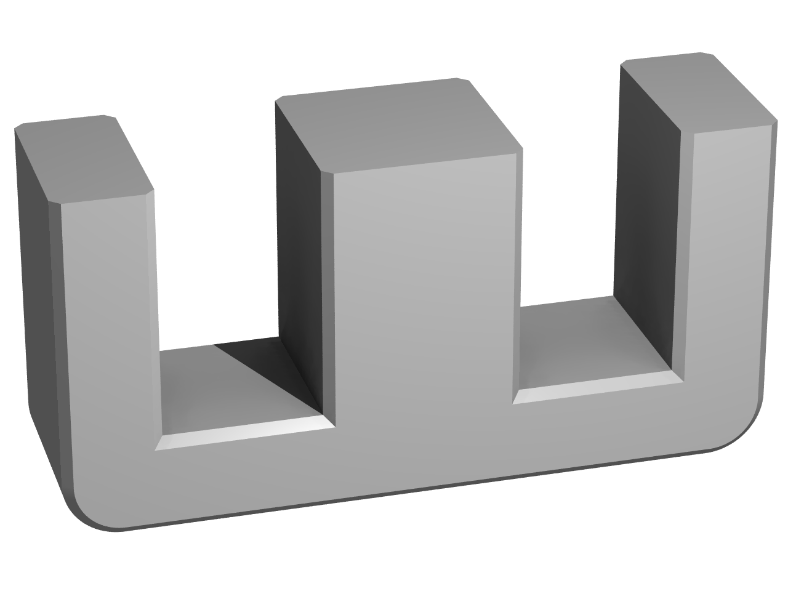    | ETD             | 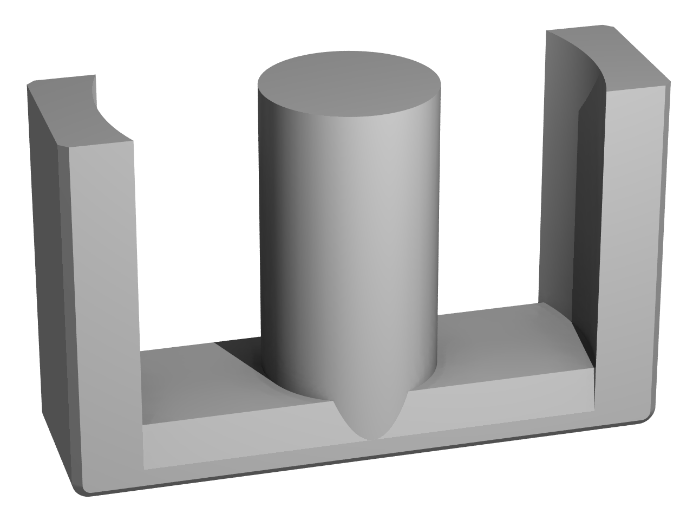 |
| EFD             | 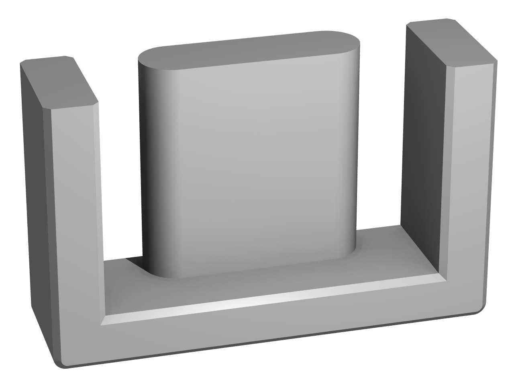 | EP              | 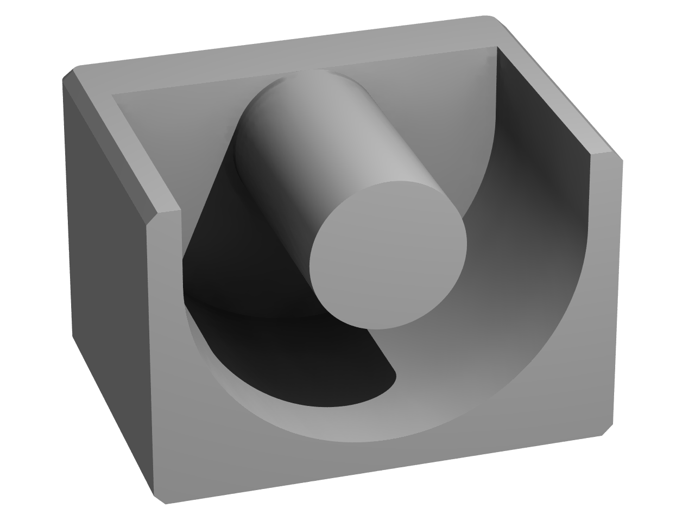   |
| Pot core        |  | RM core         | 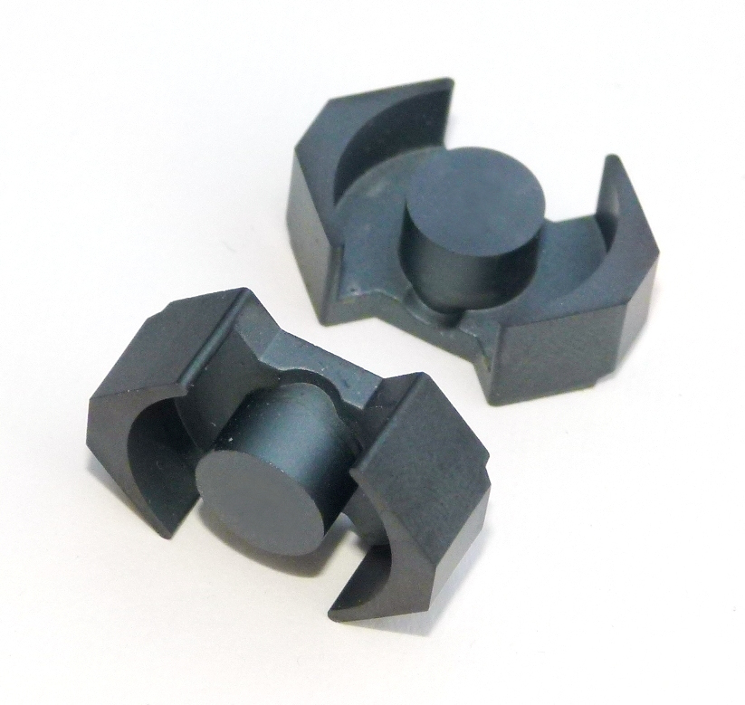   |
| PQ core         | 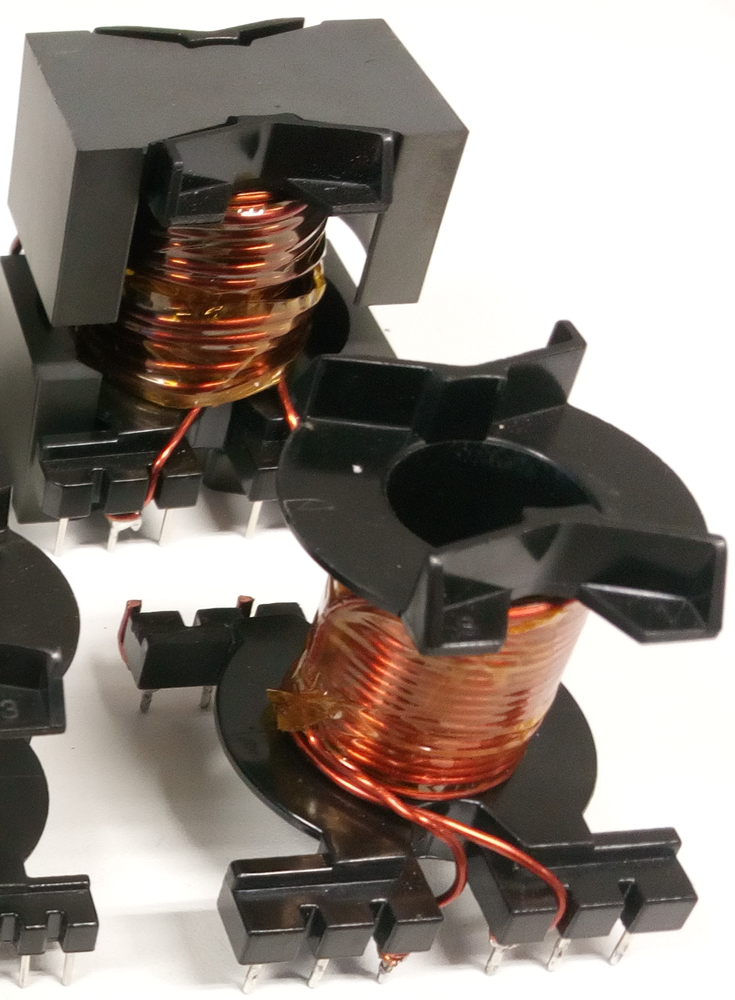   | PM core         | 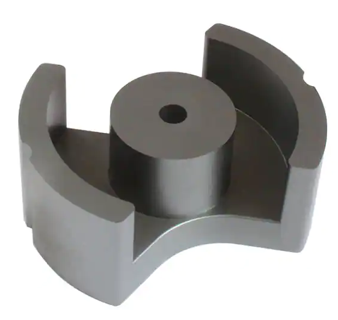   |

## Core selection


$$
A_p = A_E A_W = \frac{P_{out}}{K_c K_t B_{max} F_{SW} J} 10^4
$$


- $A_P$: product of window area and core area, $cm^2$
- $A_E$: effective cross section of the core, $cm^2$
- $A_W$: window area (or winding area), $cm^2$
- At: surface area of the transformer


$$
\begin{align*}
& A_e = 20 \times 27.4 = 540 \; mm^2 \\
& A_W \text{ (often referred in datasheets as )} A_N = 4.35 \; cm^2\\
& A_P = A_E × A_W = 5.4 \times 3.24 = 5.4 × 4.35 = 23.5 \; cm^4
\end{align*}

$$


References

- https://en.wikipedia.org/wiki/Magnetic_core
- https://e-magnetica.pl/list_of_ferrite_core_types
- [Transistor](https://electronics.stackexchange.com/users/73158/transistor), SMPS Transformer Area of Product, URL (version: 2020-06-11): https://electronics.stackexchange.com/q/504104
