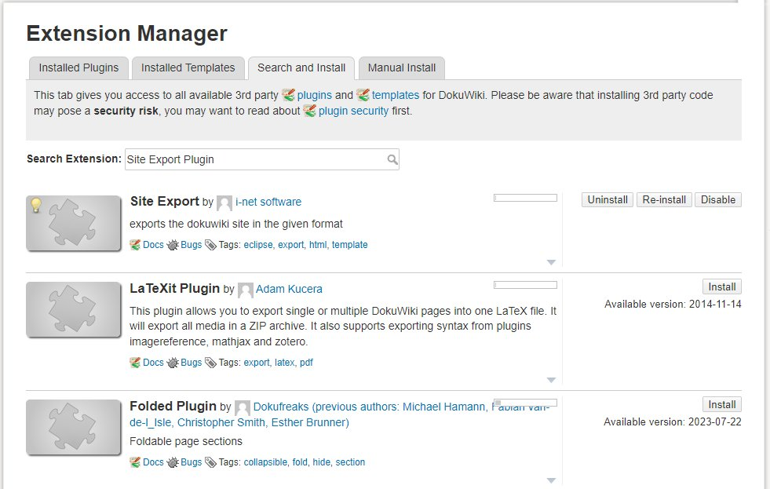
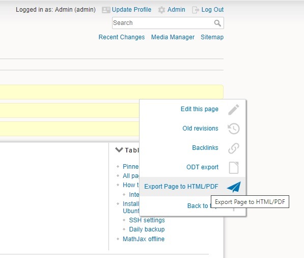
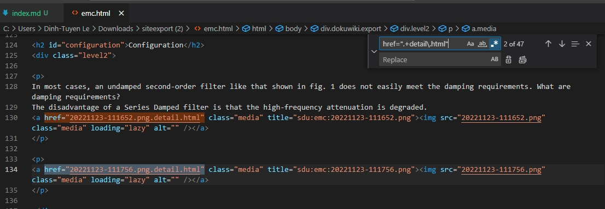
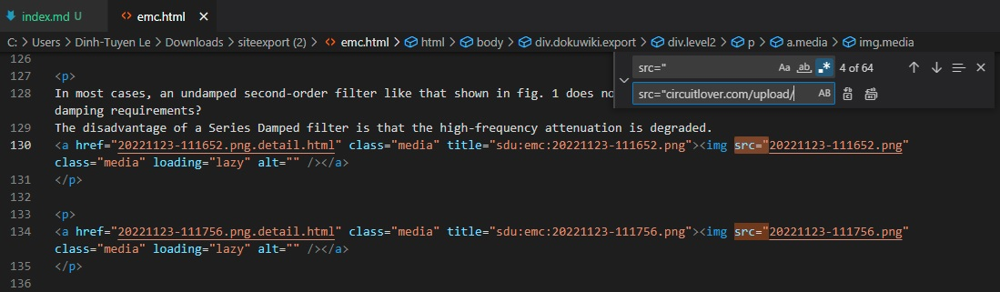
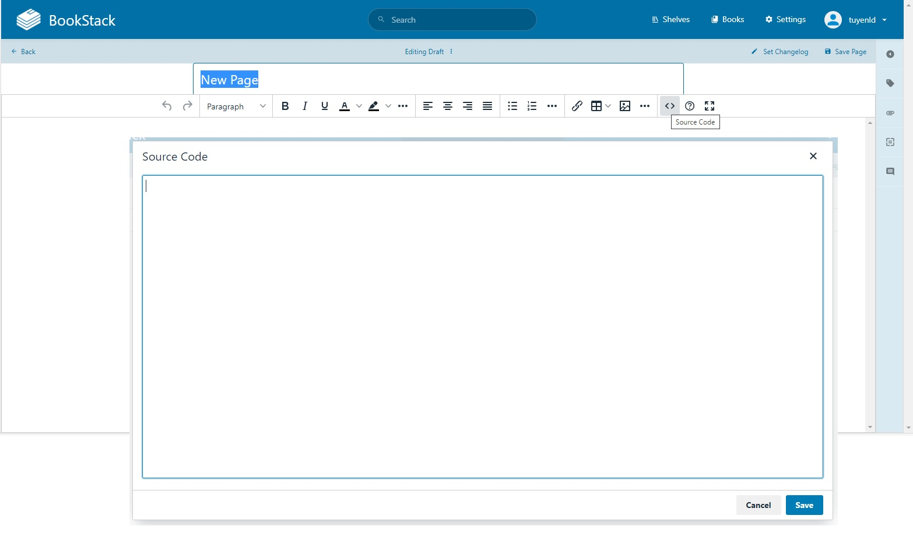
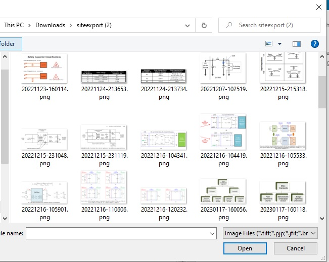

+++
title = "Migrating from Dokuwiki to Bookstack"
description = "Converting posts in Dokuwiki format to Bookstack format."
date = 2023-08-04T09:19:42+01:00

[taxonomies]
categories = ["Server"]
tags = ["dokuwiki", "Bookstack"]

[extra]
toc = true
math = true
math_auto_render = true
+++

# Recipe
- Install Dokuwiki extension [Site Export Plugin](https://www.dokuwiki.org/plugin:siteexport)
- Manually change image URI on the output html
- Create a new page and upload all images in the output directory from Site Export Plugin.

## Install Dokuwiki extension
Go to the Admin site, then search and install Site Export Plugin.

After successfully install the plugin, the will be a new menu.

Click to `Export Page to HTML/PDF`, a zip file will be download on your computer. The zip file contains a HTML file which will be modified and a folder has all of the images on the post/page.

## Change images URI

I used Visual Studio Code to manipulate the output html file. You can use your own preference editor.

Remove unnessary `href` field

Remember to click to `.*` meaning **Use regular expression**. You can test your own expression at [https://regexr.com](https://regexr.com). In this case, I used `href=".+detail\.html"` to remove the href.

You would like to change the source of these images as well. Doing it by using replace tool of VSCode. For example,
- find: `src="`
- replace by: `src="circuitlover.com/upload/`

## Create a new page and upload all images

Change to the source code mode and paste the edited HTML code here.

Now you can upload images generated by **Site Export Plugin**

# Notes
Unfortunatelly, there hasn't any official way to convert from Dokuwiki to Bookstack yet. So I need to repeat the whole process  until all the posts/pages are moved to Bookstack.

