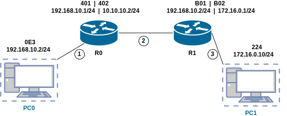

+++
title = "IP and Routing in Linux"
description = "Internet Protocol and how routing in Linux/Window works"
date = 2023-09-03T10:19:42+01:00

[taxonomies]
categories = ["Server"]
tags = ["ip", "routing"]

[extra]
toc = true
math = false
math_auto_render = false
+++

## IP

```bash
# Assign static IP for Ubuntu 14, 16
$ sudo vim /etc/network/interfaces

iface eno1 inet static
        address 172.16.10.113
        netmask 255.255.255.0
        gateway 172.16.10.1
        dns-nameservers 8.8.8.8
        up ip route add 10.10.1.0/24 via 172.16.10.1
        up ip -6 addr add 2001::2/64 dev eno1

```

Commonly used IP addresses:
- The last octet of a network address is 0, gateway address is 255
- `127.0.0.1` loopback
- `0.0.0.0` IP address does not exist

## Route trong Linux

- Routing table using **Longest Prefix Match**. For example
   - `192.168.0.0/16 next-hop 10.0.0.1 IF1`
   - `192.168.1.0/24 next-hop 11.0.0.1 IF2`
   - `192.168.1.128/25 next-hop 12.0.0.1 IF3`
   - Thus, when you want to send a message to `192.168.1.129`, you will send it via `192.168.1.128/28 IF3`

### route -n

or `ip route show`

```bash
Kernel IP routing table
Destination     Gateway         Genmask         Flags Metric Ref    Use Iface
0.0.0.0         192.168.1.254   0.0.0.0         UG    100    0        0 eno16777736
192.168.1.0     0.0.0.0         255.255.255.0   U     100    0        0 eno16777736
192.168.122.0   0.0.0.0         255.255.255.0   U     0      0        0 virbr0
```

Flags:
- G: using gateway, the difference between with and without this flag is shown below.
- U: up - active status

### route add

| Indivisual host Destination                                  | Subnet Destionation                             |
| ------------------------------------------------------------ | ----------------------------------------------- |
| `route add -net 205.192.25.0 netmask 255.255.255.0 dev eth3` | `route add -net 205.192.25.0/24 gw 203.162.5.1` |
| `route -n`                                                   | `route -n`                                      |
| `205.192.25.0 0.0.0.0 U eth3 `                               | `205.192.25.0 203.162.5.1 UG eth3`              |
| When you want to send a package to IP `205.192.25.5`,        |                                                 |
| Des. IP: 205.192.25.5                                        | Des. IP: 205.192.25.5                           |
| Des. Mac: ARP who is `205.192.25.5`                          | Des. Mac: ARP who is `203.162.5.1`              |


## How is the travel packet in the network?



| No. | IP src.      | IP des.     | MAC src. | MAC des. |
| --- | ------------ | ----------- | -------- | -------- |
| 1   | 192.168.10.2 | 172.16.0.10 | 0E3      | 401      |
| 2   | 192.168.10.2 | 172.16.0.10 | 402      | B01      |
| 3   | 192.168.10.2 | 172.16.0.10 | B02      | 224      |

**Conclude**
- IP address src. and IP des. unchanged when traversing the network (in the case of no NAT)
- MAC address src. and MAC des. is changed when passing through each Router