+++
title="Classical Control Theory"
description="Classical Control Theory series by Brian Douglas"
date=2022-04-30T09:19:42+01:00

[taxonomies]
categories = ["Control"]
tags = ["Brian-Douglas"]

[extra]
toc = true
math = true
math_auto_render = true

+++

## 1. Background

### 1.1. Step function

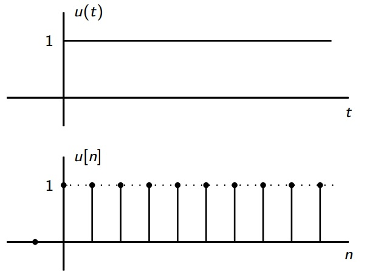


$$
\begin{align*}
    u(t)={
        \begin{cases}
        1&{\text{if }}t \ge 0 \newline  
        0&{\text{if }}t \lt 0 \newline
        \end{cases}}
    \qquad
    u[n]={
        \begin{cases}
        1&{\text{if }}n \ge 0 \newline
        0&{\text{if }}n \lt 0 \newline
        \end{cases}}
\end{align*}
$$


### 1.2. Impulse unit function (in descrete domain)

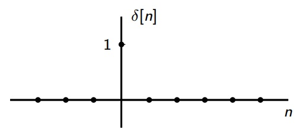


$$
\begin{align*}
    & \delta[n]={
        \begin{cases}
        1&{\text{if }}n = 0 \newline
        0&{\text{if }}n \ne 0 \newline
        \end{cases}} \newline
    & u[n] = \sum_{k = 0}^{\infty} \delta[n-k] \qquad \text{for step function} \newline
    & x[n] = \sum_{k = - \infty}^{\infty} x[k] \delta[n-k] \qquad \text{for arbitrary function}
\end{align*}
$$


We will use this relation later on.

### 1.3. "Linear and Time Invariance" (LTI) systems

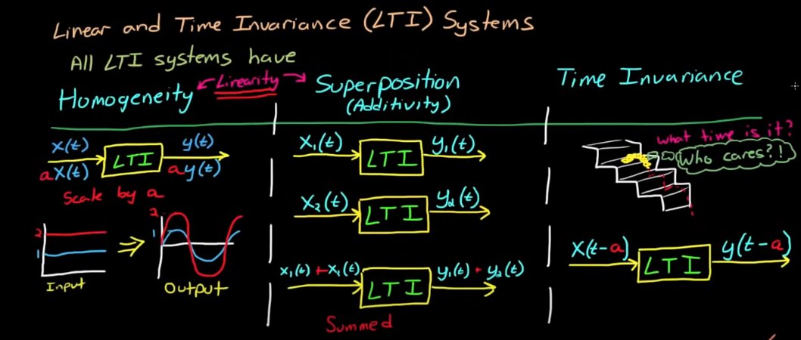

An example of LTI system.

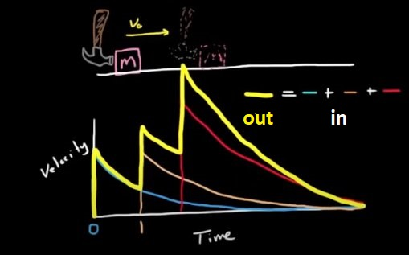

### 1.4. Laplace transformation

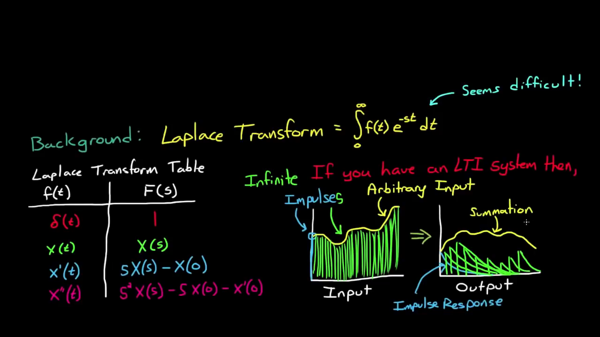

## 2. Transfer function

Q. What is impulse response $h[n]$ of a system?  
A. When the input is a impulse unit function $\delta [n]$ (see "Impulse unit function" section above)

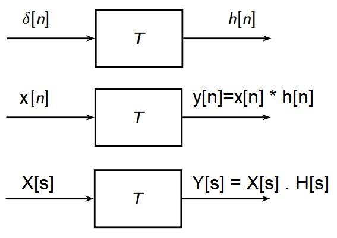


$$
\begin{align*}
    & \delta [n]\overset L \longrightarrow h[n] \qquad \text{ OR } \qquad y[n] = T\{x[n]\} \newline
    & x[n] = \sum_{k = - \infty}^{\infty} x[k] \delta[n-k] \newline
    & \Rightarrow y[n]=T \{ \sum_{k = - \infty}^{\infty} x[k] \delta[n-k] \} \overset {LTI} \longrightarrow  \sum_{k = - \infty}^{\infty} x[k] L \{\delta[n-k] \} \newline
    & \Rightarrow y[n] = \sum_{k = - \infty}^{\infty} x[k]  h[n-k] := x[n]*h[n] \quad \text{(This is convolution)}
\end{align*}
$$


Now, if we take a `Laplace` transformation of $y[n]$, we have.


$$
\begin{align*}
    & x [n]\overset L \longrightarrow X[s] \newline
    & h [n]\overset L \longrightarrow H[s] \qquad \text{(where h[n] is the impulse response of the system)} \newline
    & y [n] = x[n]*h[n] \overset L \longrightarrow Y[s] = X[s] . H[s]
\end{align*}
$$


We call $H[s]$ is the **transfer function** of the system.

An example of using impulse response in the system.

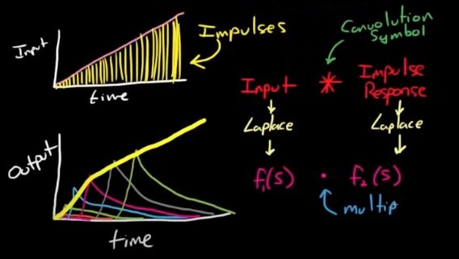

From convolution to transfer function.

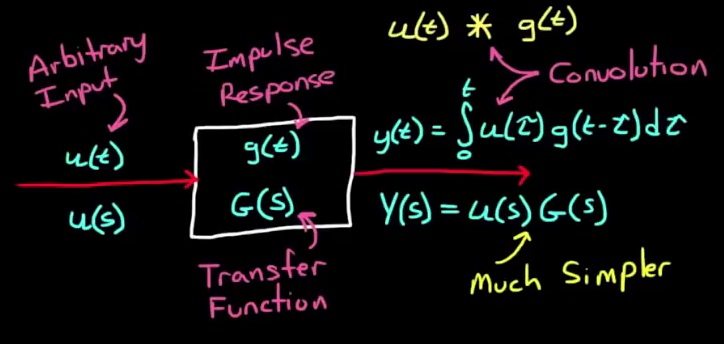

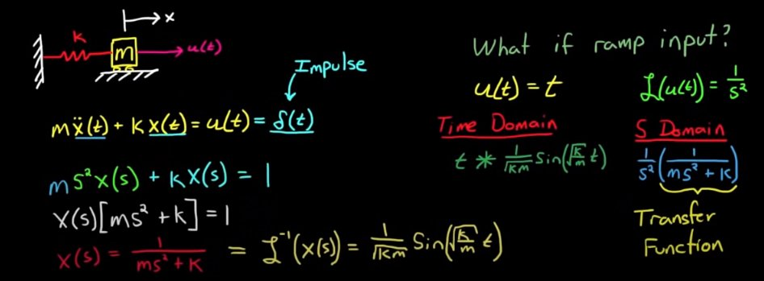

Let take a step back to understand this picture. In this case, $u(t)$ is input, and $x(t)$ is output. If we take $u(t)=\delta (t)$, we should have $x(t)=X(t)$ at the output. Taking **Laplace** transformation both side of the equation, $X(s)$ becomes **Transfer function** of the system.

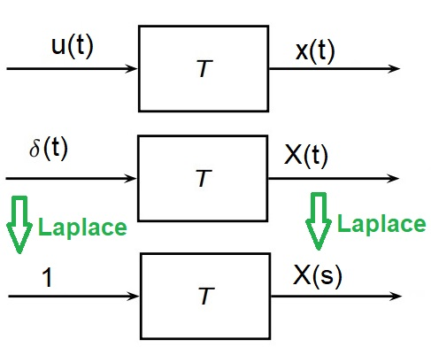

## 3. Fourier transformation

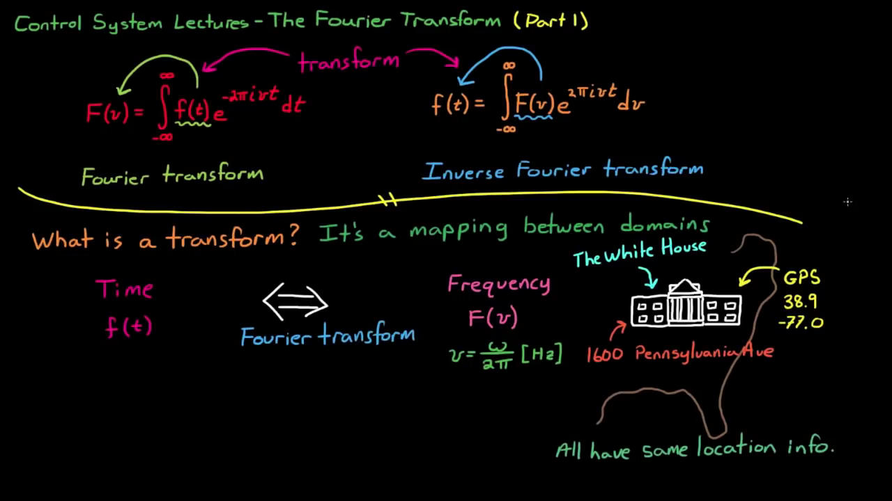

Q. Why sinusoidal?  
A. Because its shape is the same in the `LTI` system. We only need to care about amplitude $A$ (i.e. **Gain**) and phase $\Phi$.

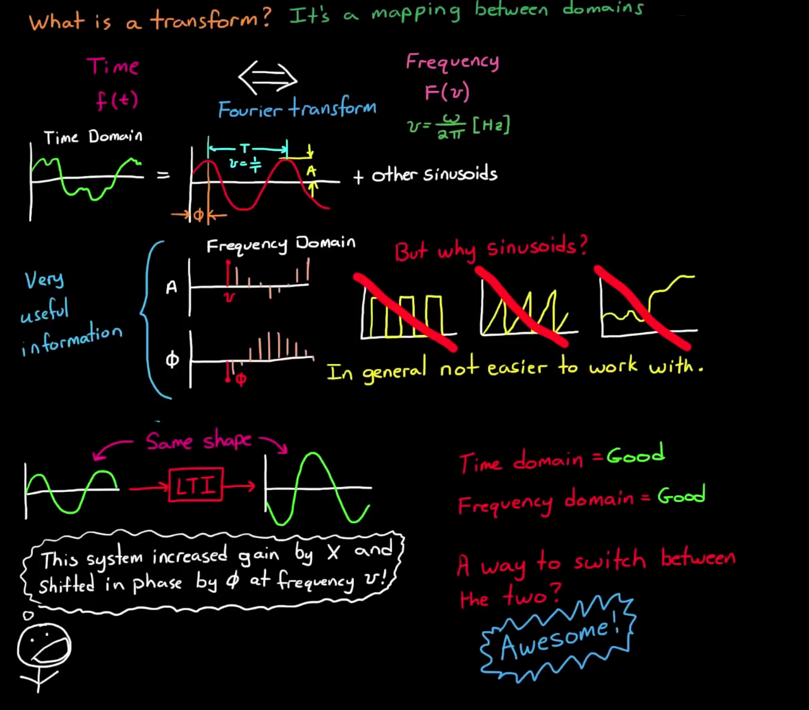

No phase information included.

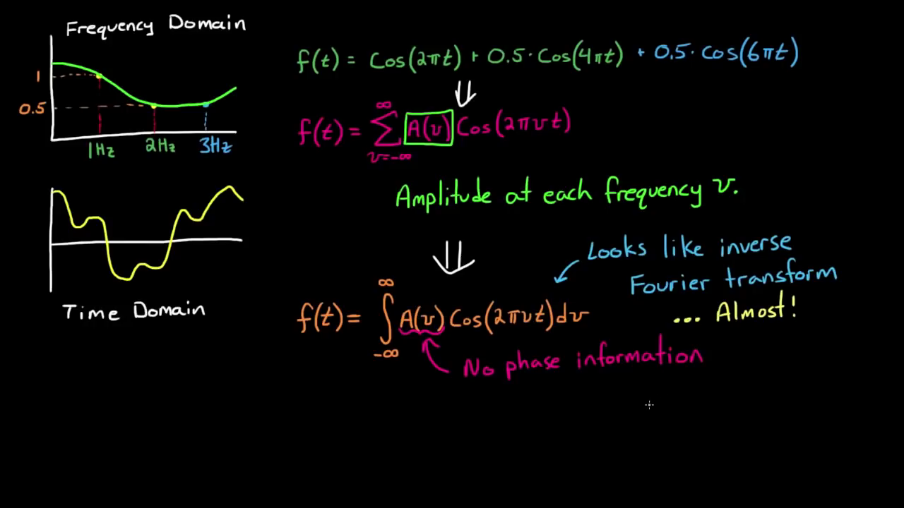

Using complex number to include phase information into account.

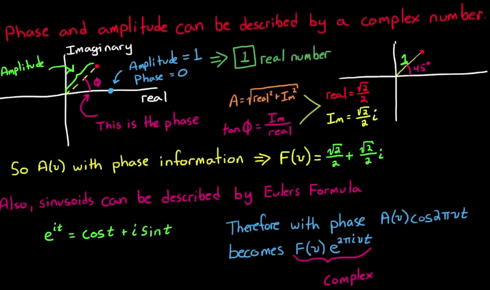


$$
\begin{align*}
    & F(v) = \cfrac{\sqrt{2}}{2} + \cfrac{\sqrt{2}}{2} j = e^{j \pi/4} \newline
    & F(v)e^{2 \pi j v t} = e^{j \pi/4} e^{2 \pi j v t}
\end{align*}
$$


## 4. References

- Brian Douglas Youtube [channel](https://www.youtube.com/user/ControlLectures), "Classical Control Theory" [series](https://www.youtube.com/playlist?list=PLUMWjy5jgHK1NC52DXXrriwihVrYZKqjk)
- Dang Quang Hieu, Digital Signal Processing lecture note
